项目编号

# 武汉大学大学生创新训练

# 计划项目中期报告

# 基于出租车数据的交通拥堵模式分析

院（系）名 称：资源与环境科学学院

专 业 名 称 ：地理科学（弘毅班）

学 生 姓 名 ：石灵奇 武秋霖阿依孜巴·艾沙

指 导 教 师 ：蔡忠亮教授

# 二○二五年二月

# INTERIM REPORT OF PLANNING

# PROJECT OF INNOVATION AND

# ENTREPRENEURSHIP TRAINING OF

# UNDERGRADUATE OF WUHAN

# UNIVERSITY

# Analysis of traffic congestion patterns

# based on taxi data

College：College of Resources and Environmental Sciences

Subject：Geographic Sciences (Hony Class)

Name： Lingqi Shi, Qiulin Wu，Ayiziba Aisha

Director：Zhongliang Cai Professor

February 2025

# 郑 重 声 明

本项目组呈交的中期报告，是在导师的指导下，独立进行研究工作所取得的成果，所有数据、图片资料真实可靠。尽我们所知，除文中已经注明引用的内容外，本报告的研究成果不包含他人享有著作权的内容。对本报告所涉及的研究工作做出贡献的其他个人和集体，均

已在文中以明确的方式标明。本报告的知识产权归属于培养单位。

石灵奇武秋霖阿依孜巴·艾沙

项目组签名：

日期： 2025 年 2 月 18 日

# 摘 要

随着城市化进程的快速发展，交通拥堵已成为全球日益严重的城市问题。交通拥堵主要是由于道路容量和交通流量的供需失衡。交通拥堵不仅降低了城市交通效率和道路安全，而且还增加了出行时间和成本。同时，交通拥堵时过量的汽车尾气排放会造成空气污染，影响到居民的健康。探索交通拥堵的原因，分析城市拥堵模式，提出相应的缓解拥堵战略，对促进经济发展、促进人民生活、实现碳峰值和碳中和目标具有重要意义。

本研究采用了主成分分析法、地理加权随机森林模型、机器学习方法 SHAP、亲和传播聚类等方法，基于出租车浮动车轨迹大数据以及道路网、建成环境等数据，以杭州市为例，进行交通拥堵评价，并分析与解读建成环境对城市交通拥堵的影响，从而为交通相关部门拥堵治理提供合理依据，促进城市发展和人民生活水平提升。

首先进行数据预处理，利用一种改进的基于隐马尔可夫模型的地图匹配算法对浮动车的 GPS 数据进行清洗，随后基于 INRIX 指数对于交通拥堵的时空规律进行分析；从密度、结构、可达性等多个建成环境方面选择针对于交通拥堵指数的探索性

变量，利用主成分分析法对于特征变量进行降维处理，利用地理加权随机森林回归模型与机器学习方法 SHAP 对于特征变量进行解释并可视化展示，再利用亲和传播聚类算法，对于特征变量以及主成分结果进行聚类，最终解读建筑环境对城市交通拥堵的影响。

关键词：轨迹大数据；亲和传播聚类；地理加权回归模型；随机森林模型；主成分分析法；建成环境

# ABSTRACT

Rapid urbanization has made traffic congestion a growing global problem, primarily due to an imbalance between road capacity and traffic flow. This congestion reduces efficiency and safety, increases travel costs, and contributes to air pollution, impacting public health. Understanding congestion causes, analyzing patterns, and developing mitigation strategies are vital for economic growth, improved living standards, and achieving carbon neutrality goals.

This study uses Principal Component Analysis (PCA), Geographically Weighted

Random Forest (GWRF), SHAP, and Affinity Propagation clustering to evaluate traffic congestion in Hangzhou, leveraging taxi GPS data, road networks, and built environment data. The research analyzes how the built environment influences congestion, aiming to inform traffic management and promote urban development.

The methodology includes data preprocessing with an improved HMM-based mapmatching algorithm for GPS data cleaning, followed by spatiotemporal analysis using the INRIX index. Built environment variables (density, structure, accessibility) are explored and reduced using PCA. GWRF and SHAP are used to interpret and visualize these variables. Affinity Propagation clustering is then applied to the features and PCA results, ultimately interpreting the built environment’s impact on urban traffic congestion.

Key words: track big data; affinity transmission clustering; geographic weighted regression model; random forest model; principal component analysis; and built environment

# 目 录

摘要…

ABSTRACT

第1章 绪论

1.1 研究背景  
1.2 研究意义…  
1.3 国内外研究综述…

1.3.1 城市交通问题的研究进展…  
1.3.2 利用轨迹数据进行交通拥堵分析 ……  
1.3.3 造成交通拥堵的原因的调查方法

1.4 研究内容

第2章 研究区域与数据处理

2.1 研究区域…… 9  
2.2 研究数据……  
2.3 浮动车数据预处理 10

第 3 章 交通拥堵评价指标计算及成因评价体系构建

3.1 交通拥堵评价指标计算  
3.1.1 道路限速等级划分  
3.1.2 拥堵指数 INRIX 计算  
3.1.3 拥堵指数时空特征分析… 12

3.2 成 因评价体 系构建… 13

# 第4章 基于地理加权随机森林模型的交通拥堵原因探究 1

4.1 地理加权随机森林模型构建

4.1.1 主成分分析法 17  
4.1.2 决策树和随机森林模型… …18   
4.1.3 空间自相关分析…… 18

4.1.4 地理加权随机森林模型… …20

4.2 可解释机器学习评价模型 SHAP 分析… 21

4.2.1 PCA-RF 模型 SHAP 分析…… … 22  
4.2.2 PCA-GWRF 模型 SHAP 分析 …28

第 5 章 基于亲和传播聚类的模式分析 34

第6章 项目进展与展望 35

参考文献…… …36

# 第 1 章 绪论

# 1.1 研究背景

随着我国经济的发展与城市化进程的加快，小汽车保有量的迅速增长。据公安部统计，2023 年全国机动车保有量达 4.35 亿辆，其中汽车 3.36 亿辆，全国有 94 个城市汽车保有量超过百万辆。伴随着汽车保有量的增加，城市道路交通拥堵问题日益严重。根据交通运输部门发布的报告，每年我国由于交通拥堵造成的经济损失达2500 亿元，占国内生产总值的 $5 \% { \sim } 8 \% ^ { [ 1 ] }$ ，成为遏制社会经济发展的绊脚石，与此同时，城市交通拥堵也会引发一系列严峻的社会问题，如城市环境恶化、居民健康水平下降、城市出行满意度降低等[2,3]。解决交通拥堵的问题势在必行。

城市道路中的交通拥堵按照其发生规律可分为两种：偶发性交通拥堵和常发性交通拥堵两种[4,5]。偶发性交通拥堵通常由交通事故、临时交通管控、路边停车等突发事件导致[6]，而常发性拥堵的成因比较复杂，城市道路网络中长期存在的规划建设缺陷、交叉口信号配时不佳等是常发性拥堵的主要诱因[7]。与偶发性拥堵相比，常发性拥堵长期存在，影响范围更广，是城市难以根除的顽疾。本项目主要是对常发性拥堵进行研究，通过挖掘建成环境对于拥堵的影响，为缓解城市常发性交通拥堵提供理论依据。

目前，衡量交通拥堵的指标主要包括行驶速度、行程时间、行程时延、服务能力、排队长度、交通流量、空间占比等[8]。这些指标的计算离不开信息的采集。传统的人工采集需要消耗大量的人力，效率低下。相比而言，移动采集技术具有较强的连续性，且采集范围广、布置成本低，尤其是随着安装车载 GPS（Global PositioningSystem，全球定位系统)设备的车辆不断增加，基于 GPS 定位的浮动车采集技术不断发展和成熟，越来越多的学者开始利用 GPS 数据进行交通系统评价[9]，政府部门也将其整合为 ITS(Intelligent Traffic System，智能交通系统)的重要组成部分，使用 GPS

数据来分析城市道路、区域、路网的交通状态已经成为智能交通系统的新趋势。

# 1.2 研究意义

本研究采用了主成分分析法、地理加权随机森林模型、机器学习方法 SHAP、亲

和传播聚类等方法，基于出租车浮动车轨迹大数据以及道路网、建成环境等数据，

以杭州市为例，进行交通拥堵评价，并分析与解读建成环境对城市交通拥堵的影响，

从而为交通相关部门拥堵治理提供合理依据，促进城市发展和人民生活水平提升。

相关领域的研究多见于基于出租车轨迹数据的拥堵识别研究，但少见分析建成

环境对拥堵的影响，且相关领域对于建成指标的选取存在不足，而我们的优势创新

点在于我们构建了多层次多方位的建成环境指标，对于造成拥堵的因素进行了综合

的分析，并考虑到了空间异质性。

# 1.3 国内外研究综述

# 1.3.1 城市交通问题的研究进展

近年来，在交通领域的有关研究不断涌现，研究者们针对交通拥堵、交通流预测、行程时间预测、碳排放等关键问题进行研究，旨在为交通规划、管理和政策制定提供科学依据。

交通拥堵依然是交通研究的核心问题，近年来的研究不仅局限于识别拥堵现象，而是更加侧重于理解拥堵形成机制、传播规律以及如何有效地缓解拥堵。部分研究聚焦于拥堵形成机制问题，基于大规模的交通流量数据、GPS数据、传感器数据等数据驱动方法被应用，以此对交通拥堵驱动力进行研究(冯心怡 2024)；部分研究采用机器学习、深度学习等技术，识别拥堵模式，建立拥堵预测模型 (Deepika andPandove 2024)；部分研究聚焦于拥堵的传播规律以及如何有效缓解拥堵方面，通过仿真模拟方法，建立微观、宏观交通仿真模型，为有效疏解交通拥堵提出了实质性交通管理策略(刘格格2022)；在控制优化方法方面，研究者提出了自适应信号控制、交通流引导、动态路径规划等方法，并将深度强化学习方法与交通控制系统的结合，旨在优化交通资源配置，缓解拥堵，有效解决智能交通信号控制中状态信息获取不准确、控制算法鲁棒性差以及区域协调控制能力弱等问题(于泽 2023)。

作为城市交通系统的核心动态要素，交通流的时空分布特性直接映射道路资源利用效率，并与通勤延误、尾气污染等城市病存在显著关系，成为破解交通拥堵困局的关键切入点。在交通流预测方面，近年的研究越来越注重短时交通流预测，以

满足实时交通控制的需求(尹迁齐 2024)。而现有研究对于交通流深度挖掘时空关联性仍不够充分，为此有研究采用时空关联特征参数进行预测(王润祺 2024; 尹迁齐2024)。部分研究以多源数据融合方法，融合了如交通流量、气象数据、事件数据等多种数据来源，建立基于多影响因素的交通流速度预测模型，以提高预测的准确性和鲁棒性(刘思林 2024)。针对交通状态改变后原有预测模型预测准确性下降问题，部分研究将迁移学习和深度学习方法相结合，对交通状态发生改变期间的交通预测具有良好的适应性(王佳泽 2023)。

作为交通管理系统优化的关键指标，行程时间预测精度与路网通行效率间密切关联，其预测误差的时空累积效应不仅会加剧交通流的速度波动与密度失衡，更可能通过路径选择的正反馈机制诱发区域级联性拥堵。在有关行程时间的研究方面，近年研究不仅有对行程时间的预测，还有对于行程时间延误与可靠性的估计。部分研究聚焦于行程时间的影响因素，探究交通需求周期性和随机波动对于行程时间的影响，以此为基础建立对行程时间的预测模型(千梦晗 2020)。部分研究聚焦于行程时间的延误及可靠性，利用浮动车数据匹配了快速路车辆轨迹，提出了一种路径行程

时间迭代预测法,有效降低了行程时间预测结果的误差，对行程时间可靠性进行了估测(刘桐2021)。部分研究聚焦于基于行程时间的路径推荐方法，通过机器学习算法，进行拥堵区避让的路径选择推荐，可有效降低路网拥堵均衡指数(李晓玉 ，邢雪2023)。

在碳排放方面，随着环保意识的增强和低碳经济的发展，交通领域的碳排放问题也日益受到关注。近年的研究致力于探究碳排放的影响因素，评估不同交通模式下的碳排放量，基于交通活动数据、车辆类型数据、燃料消耗数据等，建立碳排放计算模型并提出减少碳排放的策略。部分研究聚焦于研究交通拥堵与碳排放之间的关系(Christin and Kirsten 2022; Ibrahim et al. 2024; Tassinari 2024)。部分研究聚焦于交通碳排放测算方法与影响因素，通过对比分析城市交通碳排放计算方法，包括燃料分类排放计算法、行驶里程排放计算法、交通出行分担碳排放计算法，阐述了各种碳排放因素分解模型的优缺点及适用范围(保丽霞 2024)

交通问题是城市发展中需要持续关注和解决的问题之一。其中交通拥堵，仍然是城市中最突出且老生常谈的话题（Cervero, R. 2017）。交通拥堵成为制约城市发

展的关键因素。交通拥堵不仅增加了人们在道路上所消耗的时间，大幅提高了交通事故的发生率，还加剧了环境污染，提高了相关部门运营的成本(李爱贞 ，刘元锋2024)。因此，我们需要进一步探究拥堵的成因和传播机理,以及如何从建成环境角度入手，解决交通问题。

# 1.3.2 利用轨迹数据进行交通拥堵分析

随着全球定位系统（GPS）和移动通信技术的普及，海量的车辆轨迹数据被收集，为交通拥堵分析提供了前所未有的机会。这些轨迹数据不仅包含车辆的位置信息，还蕴含着丰富的速度、加速度、方向等信息，能够更精细地刻画交通流的动态变化。近年来，基于轨迹大数据的拥堵分析研究取得了显著进展，为交通管理和规划提供了有力支撑。

利用轨迹数据准确识别和预测交通拥堵的时空分布是基础性工作。研究不再局限于简单的速度阈值判断，而是更加注重从轨迹数据中挖掘拥堵的复杂模式。部分研究通过聚类算法对轨迹数据进行分析，识别拥堵区域，通过融合 KMeans $^ { + + }$ 与DBSCAN 算法优化聚类运算效率，平衡海量数据分析的准确性与效率，实现大规模

轨迹运动的有效识别(罗绍辉 ，罗奕俊 2023)。部分研究基于时空模式进行拥堵预测，通过使用 ILSTM（Improved Long Short-Term Memory, ILSTM）的交通流预测模型，充分考虑复杂路网交通流的时间和空间特征(张俊溪 2024)。 还有研究者利用时空注意力机制，将注意力模块 ECA 与图卷积神经网络(GCN)相结合,建立了一个基于ECA-ASTGCN 的交通流量预测模型，并使用 AdapGL 算法获取节点之间的隐藏空间相关性，捕捉交通拥堵的时空动态变化，实现更精确的预测(赖莹 2023)。部分研究利用优化的机器学习模型预测交通拥堵,与 ARIMA 和 LSTM 模型相比，使用 eXtreme梯度增强（XGBoost）的机器学习模型明显优于这些方法，展示了强大的预测能力(Deepika and Pandove 2024)

部分研究聚焦于利用轨迹大数据对城市交通拥堵驱动力研究，利用手机信令数据、高德实时交通态势数据、POI数据等多源大数据，对比了普通最小二乘法回归模型、经典地理加权回归模型、多尺度地理加权回归（MGWR）模型的精度，最终得到MGWR模型对交通拥堵驱动力的拟合效果较好，且能反映不同驱动力间的空间异质性的结论(冯心怡 2024)

在基于轨迹数据的交通拥堵传播分析方面，部分研究采用 STC 算法（Spatial-Temporal Congestions Algorithm），依据路网交通状况构建拥堵传播树，引入动态贝叶斯网络建立拥堵传播模型，得到拥堵传播概率以量化拥堵传播可能性，为交通拥堵预测模型的构建提供有效依据(程小云 2022; 屈霞萍2023)。部分研究在时空图神经网络的基础上,结合路网中路段拥堵状态因果关联关系提出了一种路网拥堵预测方法(陈蕊 2023)。部分研究基于时空因果性挖掘的交通拥堵演变过程，利用传递熵表征路网中路段之间状态相互影响的因果关系，对拥堵发生的起点、历史传播路径进行过程性追溯,并对未来演变路径进行预测（Chen，2022）。部分研究通过多智能体仿真方法，模拟拥堵的传播过程，并评估不同控制策略的效果；基于灾害蔓延理论进行的轨道交通网络拥堵传播仿真分析，对影响拥堵传播状况的各类因素进行了仿真测试，为拥堵控制策略的制定提供了理论基础(华怡夏 2020)

拥堵不仅影响了出行效率，还会带来一系列负面影响，如碳排放增加、交通事故发生率上升等；许多研究利用轨迹数据分析拥堵与这些负面影响之间的关联。部分研究聚焦于轨迹的碳排放估算，通过轨迹数据估算不同路段的碳排放量，并分析

拥堵对碳排放的影响；有研究基于拥堵系数对上海市道路高分辨率碳排放时空分配方法进行研究，有助于上海市道路碳排放清单动态更新、浓度模拟和排放特征分析(陈佳昊 ， 项雅静 2024)。部分研究聚焦于拥堵与交通事故关联，分析拥堵指数对高速公路交通事故的影响，对高速公路交通事故发生的原因做出科学合理的解释(赵晓华 2024)；以及研究交通事故导致的高速公路拥堵状态判别方法(张驰 2023)，为高速公路事故的科学治理提供理论支撑。部分研究聚焦于拥堵对出行行为影响分析，例如在道路拥堵收费情境下私家车通勤者出行选择行为研究，为交通规划提供依据(姜凡 2021)。

尽管基于轨迹大数据的拥堵分析取得了显著进展，但现有研究仍存在一些不足之处，如对建成环境因素的考虑不足。现有研究大多关注交通流本身，较少考虑建成环境因素（如道路密度、土地利用混合度、公共交通设施密度等）对拥堵的影响。尽管有些研究意识到了建成环境的重要性，但仍存在一些局限性，如研究的普遍性与可转移性差，未能深入探究建筑环境与交通拥堵之间的因果关系随时间的变化以及特定时间范围内的模式；变量选择具有局限性，忽略了一些重要的解释变量；同

时对于变量之间存在线性关系的假设可能无法捕捉非线性特征，导致模型结果中出

现潜在偏差(Xiao, Kim, and Zheng 2024)。

# 1.3.3 造成交通拥堵的原因的调查方法

交通拥堵的成因复杂，涉及多个因素的相互作用。为了深入理解拥堵的发生机制并进行有效预测，研究者们广泛采用了各种分析方法，如线性回归，非线性回归，可解释机器学习方法、聚类分析，点密度等。

部分研究采用线性回归的统计建模方法，假设因变量拥堵程度与自变量交通流量、道路密度、社会经济因等各种影响因素之间存在线性关系，通过拟合一条直线或高维超平面来描述这种关系，初步探索交通拥堵与各种影响因素之间的关系，并识别显著的关联因素(Walid et al. 2023)。但线性回归模型存在无法捕捉复杂的非线性关系，容易受到异常值的影响，以及可能存在多重共线性问题，导致参数估计不准确。

部分研究通过构建非线性回归模型，分析拥堵程度与某些影响因素之间的非线性关系，例如基于道路长度、车道数、车辆数、汽车活跃概率值等指标建立了评价

交通拥堵度的初等数学模型(I., G., and Konstantinos 2011; 王正 2009)。但非线性回归模型存在参数估计难度大、容易出现过拟合问题以及参数的解释性较弱的缺点。

随着机器学习的兴起，神经网络、支持向量机等各种复杂模型被用于拥堵预测。然而，这些模型的“黑箱”特性使其难以解释。因此，Explainable AI（XAI）方法应运而生，旨在提高模型的透明度和可解释性。常用的 XAI 方法包括 SHAP、LIME 等。可解释机器学习方法被用于分析复杂模型预测拥堵的原因，并识别重要的影响因素。通过 SHAP 方法对影响因素和道路速度间响应关系进行建模,同时提出多源影响因素到特征因子的映射方法,探索路网结构、天气、空气质量及节假日等特征因子对道路速度的非线性影响,并挖掘道路特征因子与其对应特征重要性间的内在关系(王铎2024; 崔美琪 2023)。 XAI 可以解释复杂模型的预测结果，从而理解模型的决策过程，并有助于发现隐藏的规律和影响因素。

聚类分析是一种无监督学习方法，用于将相似的交通数据分组。常用的聚类算法包括 K-means、DBSCAN 等。聚类分析在研究中被用于识别交通拥堵的热点区域，将不同类型的拥堵模式进行分类。利用 K-means 算法可以对各个常发拥堵路段的拥

堵指数日内变化曲线进行模式识别(方德春 2017; 孙灵凤 ，张国 2017; 叶秋时 2019)，

便于制定有针对性的交通管理策略。

部分研究利用点密度分析方法，计算空间中点要素的分布密度。在交通领域，点要素通常代表交通事故、拥堵事件等。点密度分析可用于识别交通事故高发区域、拥堵热点区域。部分研究通过地图 API 进行道路堵点识别和运行状态分析(黄飞2024)，部分研究基于交通工具占用面积密度进行海上交通拥堵评估(Tae, Kyou, andYoung 2017)，从而为交通安全管理和拥堵治理提供依据。

虽然上述方法在交通拥堵分析中发挥了重要作用，但现有研究仍然存在一些不足之处，如许多研究仍采用线性模型来分析交通拥堵问题，可能无法充分捕捉拥堵与各种影响因素之间复杂的非线性关系。尽管部分研究使用非线性模型，但对非线性关系的深入理解和建模仍有待加强。现有研究大多忽略了空间异质性， 例如没有充分考虑城市中心区和郊区拥堵成因的差异性；交通拥堵在不同区域可能表现出不同的特征，并且受到当地特定环境因素的影响，空间异质性的缺乏考虑可能会导致模型失效(王铎 2024)。现有研究对参数共线性的处理不足； 交通拥堵的影响因素往

往是相互关联的，例如道路密度与土地利用混合度之间可能存在较高的共线性，这可能导致模型参数估计的不准确。

# 1.4 研究内容

本文基于杭州市 2017 年 12 月 4 日——2017 年 12 月 10 日的出租车 GPS 数据、道路网数据、建成环境统计数据等，基于INRIX指数对拥堵以及常发性拥堵做出识别。基于 INRIX 指数对于交通拥堵的时空规律进行分析；从密度、结构、可达性等多个建成环境方面选择针对于交通拥堵指数的探索性变量，利用主成分分析法对于特征变量进行降维处理，利用地理加权随机森林回归模型与机器学习方法 SHAP 对于特征变量进行解释并可视化展示，再利用亲和传播聚类算法，对于特征变量以及主成分结果进行聚类，最终解读建筑环境对城市交通拥堵的影响

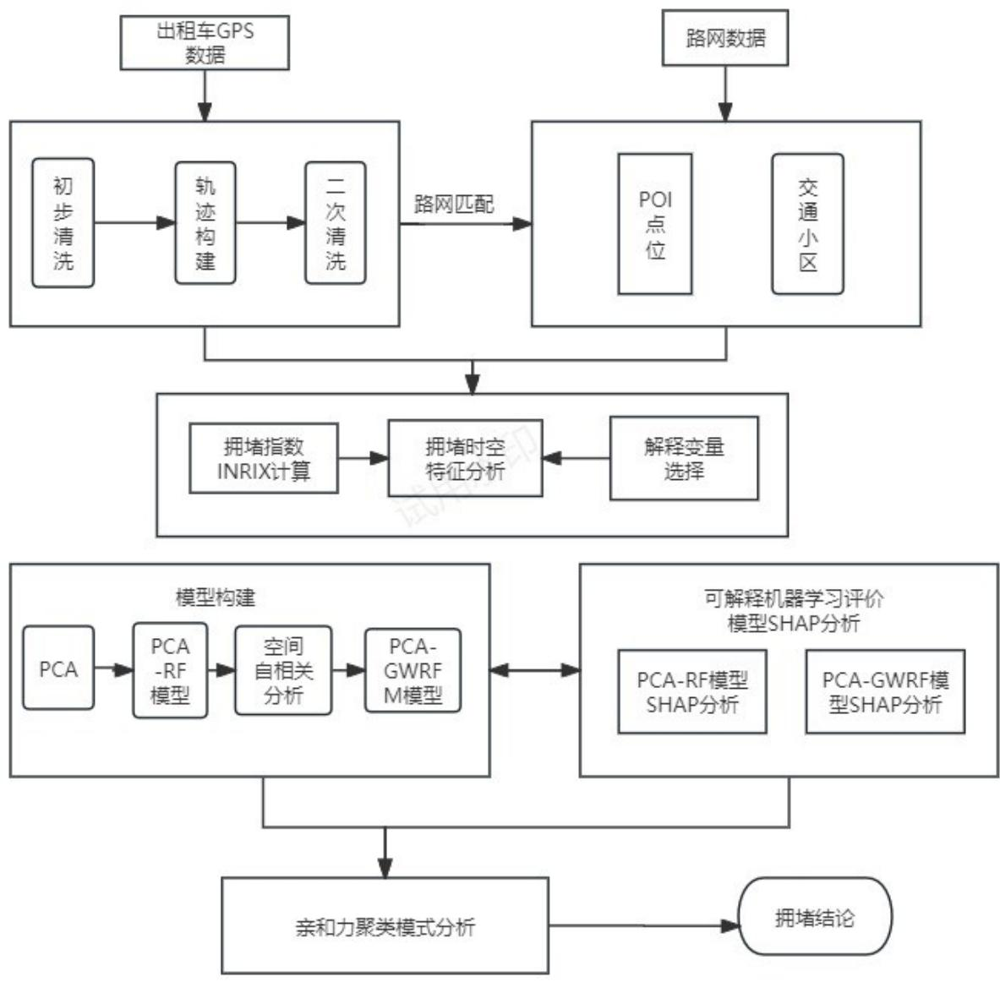  
图1.1 技术路线图

# 第2章 研究区域与数据处理

# 2.1 研究区域

本研究所探索的杭州市，是浙江省的省会，坐落于中国东南沿海长江三角洲的南翼，地理位置优越，经济发展迅速。近年来，伴随着城市化进程的加速和机动车保有量的持续增长，交通拥堵问题日益突出，严重影响了市民的出行效率和生活质量，也给城市的可持续发展带来了挑战。尤其是在高峰时段，主干道和重要路口常常出现交通滞缓甚至瘫痪的现象。为了更深入地了解杭州市交通拥堵的成因和空间分布特征，本研究将聚焦于杭州市中心城区，分析其拥堵模式，旨在为缓解城市交通压力、优化交通管理提供科学依据和可行性建议。选择中心城区作为研究区域，一方面是因为该区域人口密度高、商业活动集中，是交通拥堵最为严重的区域；另一方面，中心城区也是城市交通规划和管理的核心区域，研究结果对改善整个城市的交通状况具有重要的参考价值。

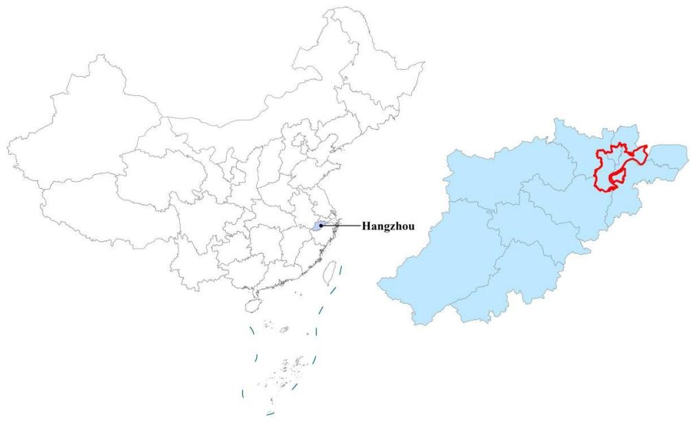  
图2.1研究区在杭州和中国境内的位置

# 2.2 研究数据

本文研究数据基于杭州市 2017 年 12 月 4 日—— 2017 年 12 月 10 日的出租车

GPS 数据以及道路网数据、交通分析区数据，同时统计了中心城区内建成环境指标

的相关数据，如各类POI点位数量、房价租金、人口密度、各年龄段密度的指标。

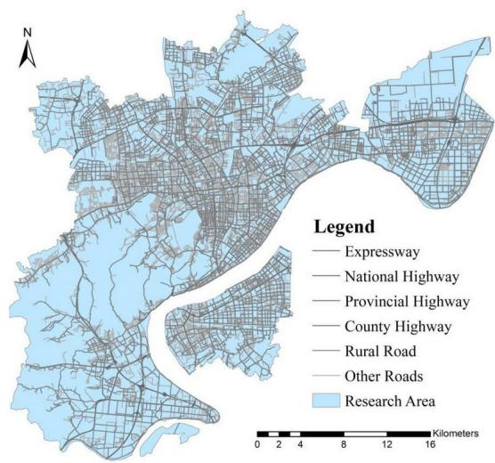  
(a) 道路网络数据

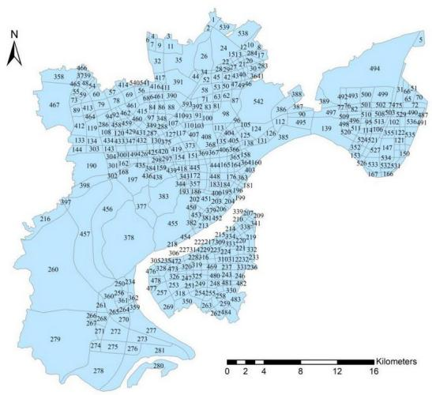  
(b)交通分析区  
图 2.2 路网及交通分析区

# 2.3 浮动车数据预处理

对于浮动车的轨迹构建与地图匹配，采用 IHMM-MM 算法[10]。该算法通过引入点线关系函数筛选分组候选点并重新定义观测概率，修改转移概率考虑相关距离关系以确保连通性，引入行驶时间控制解空间并填充关键轨迹点，提升了地图匹配精度和轨迹数据处理能力。其算法流程包括数据初始化、候选路段提取、维特比算法计算及递归求解，最终实现地图匹配并得到完整轨迹。

# 第 3 章 交通拥堵评价指标计算及解释变量选择

# 3.1 交通拥堵评价指标计算

# 3.1.1 道路限速等级划分

仅从速度角度对路段进行划分。本项目的路网数据中包含的一个属性字段，其代表路段的速度限制等级

表 3.1 属性值字段与速度限制等级对应关系  

<table><tr><td>属性值</td><td>速度限制等级</td></tr><tr><td>1</td><td>&gt;130km/h</td></tr><tr><td>2</td><td>(100km/h, 130km/h]</td></tr><tr><td>3</td><td>(90km/h, 100km/h]</td></tr><tr><td>4</td><td>(70km/h, 90km/h]</td></tr><tr><td>5</td><td>(50km/h, 70km/h]</td></tr><tr><td>6</td><td>(30km/h, 50km/h]</td></tr><tr><td>7</td><td>(10km/h, 30km/h]</td></tr><tr><td>8</td><td>≤10km/h</td></tr></table>

# 3.1.2 拥堵指数 INRIX 计算

将每日的时间分割为多个统计间隔，选择 INRIX 指数作为拥堵指数指标，计算每个路段在各个统计间隔内的 INRIX 指数值。其中 $\mathrm { A i j }$ 表示路段 i 在第 j 个间隔内的INRIX 指数，Rsij 表示路段 i 在第 j 个间隔内的参考速度，即自由流下的速度值；csij表示路段 i 在第 j 个间隔内的计算速度，即路段在实际计算中得到的速度值。

$$
A _ {i j} = \left(\frac {R S _ {i j}}{C S _ {i j}} - 1\right) \times 100 \% \tag{3.1}
$$

INRIX 指数也可用于计算路网的拥堵指数。研究区域范围内道路网的 INRIX 指数值由各个路段的 INRIX 指数根据其路段长度加权相加得到，公式如（3.2）。其中Bj 为统计间隔 j 内全市的 INRIX 指数值， $\mathrm { A _ { i j } }$ 为路段 i 在第 j 个间隔内的 INRIX 指数，$\mathrm { L _ { i } }$ 为路段 i 的长度。

$$
B _ {j} = \frac {\sum_ {i = 1} ^ {N} \left(A _ {i j} \times L _ {i}\right)}{\sum_ {i = 1} ^ {N} L _ {i}} \tag {3.2}
$$

# 3.1.3 拥堵指数时空特征分析

使用 3.1.2 章节中所述的拥堵指数计算方法，分别以一周内不同天数与一周内不同地区为分类，计算每个时间段内研究区域的平均交通拥堵指数。并以时间为横坐标轴，拥堵指数为纵坐标轴，绘制出交通拥堵指数曲线，以此分析交通拥堵指数的

时空变化特征。

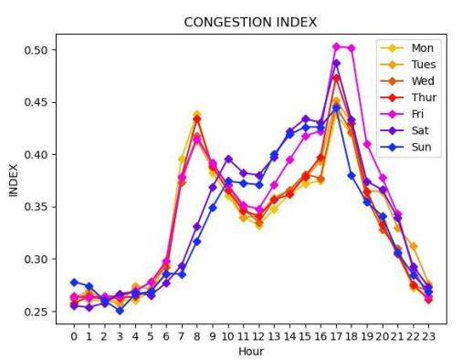

图3.1拥堵指数的统计结果  
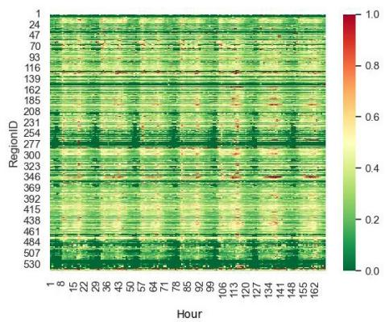  
(a) 一周内不同天数内的平均每小时交通拥堵指数(b)一周内不同地区平均每小时交通拥堵指数

由图（a）一周内不同天数内的平均每小时交通拥堵指数分析可得，交通拥堵指数随一天内时间段不同而变化，工作日（周一至周五）的拥堵曲线整体高于周末（周六和周日），表明工作日的交通压力更大。所有曲线都呈现双峰结构，对应着早高峰（大约 7-9 点）和晚高峰（大约 17-19 点）。周五的晚高峰（大约 17-19 点）的拥堵指数明显高于其他工作日，可能与周末出行需求提前释放有关。周末的拥堵曲线较为平缓，没有明显的早高峰，但可能存在午间（11-13点）的小高峰。每天的拥堵指数都呈现相似的变化趋势，但高峰强度和持续时间略有差异。

根据拥堵时间变化模式，划分出四个时段：工作日早高峰（7:00–10:00）、工作

日晚高峰（17:00-19:00）、周末早高峰（7:00–10:00）、周末晚高峰（17:00-19:00）

时间，作为下一步进行交通拥堵原因探究的数据。

由图（b）不同地区（RegionID）不同时间（Hour）的拥堵指数热力图可知，整体热力图显示出明显的周期性模式，即一天内拥堵指数呈现规律性的变化。颜色越红表示拥堵指数越高，颜色越绿表示拥堵指数越低。可以观察到在某些时间段（大约在 Hour 7-9，以及 16-19），大部分区域的拥堵指数明显升高，对应着早晚高峰。凌晨时段（Hour 0-6）的拥堵指数普遍较低，大部分区域呈现绿色或浅黄色，表明交通流量较小，为非高峰时段。

热力图体现了区域差异，某些 RegionID 的拥堵程度普遍高于其他区域。 热力图上颜色更红的横条，代表该区域一天内的平均拥堵水平更高。RegionID 323 附近呈现较深的红色，意味着该区域的交通拥堵情况较为严重。部分 RegionID 在特定时间段表现出异常的拥堵情况。这可能与该区域的特定活动或事件有关，如商业区的午间高峰或夜间的娱乐活动。

热力图反映了空间自相关性，部分相邻的 RegionID 颜色相似。相邻的几个

RegionID都在某个时间段呈现较深的红色，可能表明拥堵存在空间自相关性，即拥堵会扩散到周边区域。

通过对交通拥堵指数的时空特征进行统计，可以发现以下几个规律：

（1）拥堵具有时空异质性：杭州市的交通拥堵具有明显的时空异质性，即不同地区和不同时间的拥堵程度不同。  
（2）工作日通勤是主要拥堵驱动因素：工作日的早晚高峰是主要的拥堵时段，表明通勤出行是造成拥堵的主要原因。  
（3）周末出行模式不同：周末的出行模式与工作日不同，拥堵程度相对较轻，且没有明显的早高峰。  
（4）特定区域拥堵问题突出：某些区域的拥堵问题较为突出，需要重点关注和治理。

# 3.2 解释变量选择

以 24 个密度指标描述杭州市社会经济相关的城市建成环境的指标，如各类 POI密度；1 个多样性指标描述土地利用混合度；19 个设计指标描述描述路网拓扑结构的指标，如度中心性、介数中心性；8个目标可访问性指标，描述到达如学校、医院的距离；9个运输距离指标，描述到达各类交通站点的距离；8个需求管理指标，描

述如停车场等各类交通需求设施的密度；9个人口统计学指标，描述租金、人口密度、各年龄段密度的指标。构建多方位城市拥堵指标评价体系，选取多种解释变量，分析建成环境对于拥堵的影响。

表 3.2 交通分析区范围内交通拥堵指数的解释变量  

<table><tr><td>维度</td><td>变量</td><td>缩写词</td><td>说明</td><td>平均值标准化</td></tr><tr><td rowspan="21">密度</td><td>餐饮服务</td><td>DENS_CAS</td><td>与餐饮相关的poi 密度/km2</td><td>156.78</td></tr><tr><td>景区</td><td>DENS_SCs</td><td>与景点相关的poi 密度/km2</td><td>6.41</td></tr><tr><td>公司和企业</td><td>DENS_CM</td><td>与公司相关的poi 密度/km2</td><td>117.15</td></tr><tr><td>购物服务</td><td>DENS_SHP</td><td>与购物服务相关的poi 密度/km2</td><td>485.96</td></tr><tr><td>加油、充电站</td><td>DENS_GCS</td><td>与加油、充电站相关的poi 密度/km2</td><td>4.94</td></tr><tr><td>金融和保险服务</td><td>DENS_FIS</td><td>与金融保险服务相关的poi 密度/km2</td><td>21.61</td></tr><tr><td>酒店住宿</td><td>DENS_HT</td><td>与酒店住宿相关的poi 密度/km2</td><td>40.52</td></tr><tr><td>科学文化</td><td>DENSSCI</td><td>与科学文化相关的poi 密度/km2</td><td>48.12</td></tr><tr><td>体育休闲设施</td><td>DENS_SLF</td><td>与体育休闲设施相关的poi 密度/km2</td><td>28.83</td></tr><tr><td>停车场</td><td>DENS_PKL</td><td>与停车场相关的poi 密度/km2</td><td>61.41</td></tr><tr><td>医疗保健服务</td><td>DENS_HC</td><td>与医疗保健服务相关的poi 密度/km2</td><td>32.65</td></tr><tr><td>居住社区</td><td>DENS_RC</td><td>与居住设施相关的poi 密度/km2</td><td>17.49</td></tr><tr><td>公共汽车站</td><td>DENS_BSS</td><td>与公共汽车站相关的poi 密度/km2</td><td>94.20</td></tr><tr><td>地铁车站</td><td>DENS_SUB</td><td>与地铁车站相关的poi 密度/km2</td><td>1.33</td></tr><tr><td>火车站</td><td>DENS_RS</td><td>与火车站相关的poi 密度/km2</td><td>0.11</td></tr><tr><td>客车站</td><td>DENS_COH</td><td>与客车站相关的poi 密度/km2</td><td>0.14</td></tr><tr><td>购物中心</td><td>DENS_SM</td><td>与购物中心相关的poi 密度/km2</td><td>9.99</td></tr><tr><td>蔬菜市场</td><td>DENS_VM</td><td>与蔬菜市场相关的poi 密度/km2</td><td>1.73</td></tr><tr><td>医院</td><td>DENS_HSP</td><td>与医院相关的poi 密度/km2</td><td>11.92</td></tr><tr><td>学校</td><td>DENS_SCH</td><td>与学校相关的poi 密度/km2</td><td>9.93</td></tr><tr><td>培训机构</td><td>DENS_TI</td><td>与培训机构相关的poi 密度/km2</td><td>38.57</td></tr><tr><td rowspan="3"></td><td>家具和建材市场</td><td>DENS_FBM</td><td>与家具建材市场相关的poi 密度/km2</td><td>66.87</td></tr><tr><td>电子数码市场</td><td>DENS_EDM</td><td>与电子数码市场相关的poi 密度/km2</td><td>38.74</td></tr><tr><td>超市</td><td>DENS_SMK</td><td>与超市相关的poi 密度/km2</td><td>6.90</td></tr><tr><td>多样性</td><td>土地利用熵</td><td>DIVE_LDUE</td><td>DIVELDUE = - ∑i=1n pi log pi其中pi为土地利用类型i的比 例，n为不同土地利用类型的大 小</td><td>0.12</td></tr><tr><td rowspan="18">设计</td><td>路网</td><td>DESGN_RD</td><td>机动车网的密度km/km2</td><td>13.53</td></tr><tr><td>非机动车辆路网</td><td>DESGN_NM V</td><td>非机动车网的密度km/km2</td><td>2.92</td></tr><tr><td>行人路网</td><td>DESGN_PD</td><td>行人路网的密度km/km2</td><td>3.39</td></tr><tr><td>高架桥的出入口</td><td>DESGN_EEV</td><td>高架桥出入口的密度/km2</td><td>4.39</td></tr><tr><td>主辅道路接入点</td><td>DESGN_AM A</td><td>主辅道路接入口点密度/km2</td><td>3.88</td></tr><tr><td>高速公路网</td><td>DESGN_EWN</td><td>高速公路网的密度km/km2</td><td>4.81</td></tr><tr><td>高架路网</td><td>DESGN_ERN</td><td>高架路网的密度km/km2</td><td>4.32</td></tr><tr><td>双向分隔巷道</td><td>DESGN_DSR</td><td>双向分割巷道的密度km/km2</td><td>6.39</td></tr><tr><td>隧道道路</td><td>DESGN_TNR</td><td>隧道道路的密度km/km2</td><td>0.88</td></tr><tr><td>十字路口</td><td>DESGN_ITS</td><td>每个交叉口的密度/km2</td><td>100.50</td></tr><tr><td>主道路交叉路口</td><td>DESGN/MIT</td><td>主道路交叉路口密度/km2</td><td>65.13</td></tr><tr><td>死胡同</td><td>DESGN_DER</td><td>死角道路密度/km2</td><td>8.85</td></tr><tr><td>主道路上的死角 道路</td><td>DESGN_MDE</td><td>主道路死角道路密度/km2</td><td>2.09</td></tr><tr><td>道路中心度</td><td>DESGN_RDC</td><td>考虑与节点相关的道路数量的 节点的平均度中心性。节点度 中心性的计算公式如下: D= Nroads/n-1 其中，表示节点数，并表示与 该节点关联的道路nRoads数</td><td>0.000002</td></tr><tr><td>间歇性中心性</td><td>DESGN_BC</td><td>节点的平均中间性和中心性</td><td>0.001522</td></tr><tr><td>闭合中心性</td><td>DESGN_CC</td><td>节点的平均接近度中心性</td><td>0.000367</td></tr><tr><td>页面排名值</td><td>DESGN_PR</td><td>节点的平均页面排名值</td><td>0.000001</td></tr><tr><td>车道中心度</td><td>DESGN_LDC</td><td>考虑与节点相关的道路车道数 量的节点的平均度中心性。节 点度中心性的计算公式如下:</td><td>0.000006</td></tr><tr><td rowspan="2"></td><td></td><td></td><td>D=Nlanes/n-1其中,表示节点数,并表示与该节点关联的道路nlanes车道数</td><td></td></tr><tr><td>弯曲度</td><td>DESGN_TOR</td><td>路网弯曲度。道路弯曲度的计算公式如下:T=∑s其中为道路起止节点之间的l∑s线性长度,为道路所有路段的总长度</td><td>0.03</td></tr><tr><td rowspan="8">目标可访问性</td><td>充电站</td><td>DEAC_CHG</td><td>离充电站最近的距离(m)</td><td>1319.03</td></tr><tr><td>加油站</td><td>DEAC_GS</td><td>离加油站最近的距离(m)</td><td>758.97</td></tr><tr><td>幼儿园</td><td>DEAC_KD</td><td>离幼儿园最近的距离(m)</td><td>1803.72</td></tr><tr><td>小学</td><td>DEAC_PS</td><td>离小学最近的距离(m)</td><td>1668.04</td></tr><tr><td>中学</td><td>DEAC_MS</td><td>离中学最近的距离(m)</td><td>1655.24</td></tr><tr><td>景区</td><td>DEAC_SS</td><td>距离景点最近的距离(m)</td><td>1818.82</td></tr><tr><td>医院</td><td>DEAC_HSP</td><td>离医院最近的距离(m)</td><td>1906.78</td></tr><tr><td>购物中心</td><td>DEAC_SM</td><td>离购物中心最近的距离(m)</td><td>3955.83</td></tr><tr><td rowspan="9">运输距离</td><td>火车站</td><td>DTT_RS</td><td>离火车站最近的距离(m)</td><td>5204.87</td></tr><tr><td>机场</td><td>DTT_AP</td><td>离机场最近的距离(m)</td><td>8023.62</td></tr><tr><td>客车站</td><td>DTT_COH</td><td>距离客车站最近的距离(m)</td><td>3788.26</td></tr><tr><td>地铁车站</td><td>DTT_SUB</td><td>离地铁站最近的距离(m)</td><td>1638.31</td></tr><tr><td>地铁换乘站</td><td>DTT_SBT</td><td>距离地铁中转站最近的距离(m)</td><td>2341.37</td></tr><tr><td>公共汽车站</td><td>DTT_BSS</td><td>离公交车站最近的距离(m)</td><td>1939.26</td></tr><tr><td>公交线路</td><td>DTT_BSR</td><td>公交线路密度km/km2</td><td>89.07</td></tr><tr><td>地铁线路</td><td>DTT_SBL</td><td>地铁线路密度km/km2</td><td>1.89</td></tr><tr><td>地铁与公交之间的换乘</td><td>DTT_TSB</td><td>距地铁站800m内的公交线路数</td><td>40.77</td></tr><tr><td rowspan="7">需求管理</td><td>专用停车场</td><td>DEMA_DPK</td><td>专用停车场的密度/km2</td><td>5.17</td></tr><tr><td>路边停车场</td><td>DEMA_RPK</td><td>路边停车场的密度/km2</td><td>7.88</td></tr><tr><td>公共停车场</td><td>DEMA_PPK</td><td>公共停车场的密度/km2</td><td>18.97</td></tr><tr><td>停车场出入口</td><td>DEMA_PKE</td><td>停车场出入口的密度/km2</td><td>6.03</td></tr><tr><td>加油站</td><td>DEMA_GS</td><td>加油站的密度/km2</td><td>0.72</td></tr><tr><td>充电站</td><td>DEMA_CHG</td><td>充电站的密度/km2</td><td>3.66</td></tr><tr><td>地铁出入口</td><td>DEMA_SBE</td><td>地铁出入口的密度/km2</td><td>3.68</td></tr><tr><td></td><td>地铁换乘站</td><td>DEMA_SBT</td><td>地铁换乘站的密度/km2</td><td>0.91</td></tr><tr><td rowspan="9">人口统计学</td><td>每平方米租金</td><td>DEMO_RT</td><td>平均租金/m2</td><td>7.91</td></tr><tr><td>单位平均租金</td><td>DEMO_AR</td><td>单位平均租金</td><td>963.74</td></tr><tr><td>房价</td><td>DEMO_HP</td><td>平均房价/m2</td><td>11124.96</td></tr><tr><td>租金与价格的比率</td><td>DEMO_RP</td><td>出租房屋与销售房屋的比率</td><td>0.09</td></tr><tr><td>总人口</td><td>DEMO_TP</td><td>总人口/km2</td><td>10659.20</td></tr><tr><td>17岁及以下人口</td><td>DEMO_P17</td><td>17岁及以下人口/km2</td><td>1091.00</td></tr><tr><td>18-35岁人口</td><td>DEMO_P18_35</td><td>年龄在18-35岁人口/km2</td><td>3998.35</td></tr><tr><td>36-64岁人口</td><td>DEMO_P36_64</td><td>年龄在36-64岁人口/km2</td><td>4817.90</td></tr><tr><td>65岁及以上的人口</td><td>DEMO_P65</td><td>65岁及以上人口/km2</td><td>1701.56</td></tr></table>

# 第 4 章 基于地理加权随机森林模型的拥堵原因探究

# 4.1 地理加权随机森林模型构建

# 4.1.1 主成分分析法

主成分分析法 (Principal Component Analysis, PCA) 是一种广泛应用于数据分析、模式识别和机器学习领域的统计技术。其基本原理是将原始数据通过线性变换投影到新的坐标系中，使得投影后的各个维度（即主成分）是线性无关的，并且方差依次递减。 第一主成分的方向是数据方差最大的方向，代表了数据集中最大的信

息量； 第二主成分与第一主成分正交，且是剩余方差最大的方向，以此类推。 通过选择前几个方差较大的主成分来代替原始数据，可以有效地降低数据维度，同时尽可能地保留原始数据的信息，从而简化模型，提高计算效率，并有助于可视化数据。

利用上一章标准化的数据，选择保留使得累计方差比例超过 $80 \%$ 的主成分，得到保留的主成分数量是 19，进行主成分分析，得到转换后的数据和成分权重，如下图所示。

<table><tr><td></td><td>Comp1</td><td>Comp2</td><td>Comp3</td><td>Comp4</td><td>Comp5</td><td>Comp6</td><td>Comp7</td><td>Comp8</td><td>Comp9</td><td>Comp10</td><td>Comp11</td><td>Comp12</td><td>Comp13</td><td>Comp14</td><td>Comp15</td><td>Comp16</td><td>Comp17</td><td>Comp18</td><td>Comp19</td><td></td><td></td><td></td><td></td><td></td><td></td><td></td><td></td><td></td><td></td><td></td><td></td><td></td><td></td><td></td><td></td><td></td><td></td><td></td><td></td><td></td><td></td><td></td><td></td><td></td><td></td><td></td><td></td><td></td><td></td><td></td><td></td><td></td><td></td><td></td><td></td><td></td><td></td><td></td><td></td><td></td><td></td><td></td><td></td><td></td><td></td><td></td><td></td><td></td><td></td><td></td><td></td><td></td><td></td><td></td><td></td><td></td><td></td><td></td><td></td><td></td><td></td><td></td><td></td><td></td><td></td><td></td><td></td><td></td><td></td><td></td><td></td><td></td><td></td><td></td><td></td><td></td><td></td><td></td><td></td><td></td></tr><tr><td>DENS CAS</td><td>0.1478</td><td>0.1053</td><td>0.2107</td><td>0.0463</td><td>0.0132</td><td>-0.0499</td><td>0.0758</td><td>0.0515</td><td>0.0426</td><td>0.0822</td><td>0.0088</td><td>0.0460</td><td>0.0467</td><td>0.0105</td><td>0.0279</td><td>0.0111</td><td>-0.0661</td><td>0.0604</td><td>0.1260</td><td></td><td></td><td></td><td></td><td></td><td></td><td></td><td></td><td></td><td></td><td></td><td></td><td></td><td></td><td></td><td></td><td></td><td></td><td></td><td></td><td></td><td></td><td></td><td></td><td></td><td></td><td></td><td></td><td></td><td></td><td></td><td></td><td></td><td></td><td></td><td></td><td></td><td></td><td></td><td></td><td></td><td></td><td></td><td></td><td></td><td></td><td></td><td></td><td></td><td></td><td></td><td></td><td></td><td></td><td></td><td></td><td></td><td></td><td></td><td></td><td></td><td></td><td></td><td></td><td></td><td></td><td></td><td></td><td></td><td></td><td></td><td></td><td></td><td></td><td></td><td></td><td></td><td></td><td></td><td></td><td></td></tr><tr><td>DENS SCS</td><td>0.1268</td><td>0.0973</td><td>0.1519</td><td>0.0965</td><td>-0.1156</td><td>-0.0069</td><td>0.0163</td><td>0.1490</td><td>-0.1490</td><td>0.0314</td><td>0.1435</td><td>0.1861</td><td>-0.0019</td><td>0.0148</td><td>-0.0094</td><td>0.0298</td><td>0.0798</td><td>-0.0233</td><td>-0.0680</td><td></td><td></td><td></td><td></td><td></td><td></td><td></td><td></td><td></td><td></td><td></td><td></td><td></td><td></td><td></td><td></td><td></td><td></td><td></td><td></td><td></td><td></td><td></td><td></td><td></td><td></td><td></td><td></td><td></td><td></td><td></td><td></td><td></td><td></td><td></td><td></td><td></td><td></td><td></td><td></td><td></td><td></td><td></td><td></td><td></td><td></td><td></td><td></td><td></td><td></td><td></td><td></td><td></td><td></td><td></td><td></td><td></td><td></td><td></td><td></td><td></td><td></td><td></td><td></td><td></td><td></td><td></td><td></td><td></td><td></td><td></td><td></td><td></td><td></td><td></td><td></td><td></td><td></td><td></td><td></td><td></td></tr><tr><td>DENS CM</td><td>0.1225</td><td>0.1109</td><td>0.2313</td><td>0.0388</td><td>-0.0196</td><td>0.0273</td><td>0.0582</td><td>-0.1202</td><td>0.0444</td><td>-0.0955</td><td>-0.0933</td><td>-0.0302</td><td>-0.0770</td><td>-0.0570</td><td>0.0799</td><td>0.0320</td><td>-0.0271</td><td>-0.0995</td><td>-0.0970</td><td></td><td></td><td></td><td></td><td></td><td></td><td></td><td></td><td></td><td></td><td></td><td></td><td></td><td></td><td></td><td></td><td></td><td></td><td></td><td></td><td></td><td></td><td></td><td></td><td></td><td></td><td></td><td></td><td></td><td></td><td></td><td></td><td></td><td></td><td></td><td></td><td></td><td></td><td></td><td></td><td></td><td></td><td></td><td></td><td></td><td></td><td></td><td></td><td></td><td></td><td></td><td></td><td></td><td></td><td></td><td></td><td></td><td></td><td></td><td></td><td></td><td></td><td></td><td></td><td></td><td></td><td></td><td></td><td></td><td></td><td></td><td></td><td></td><td></td><td></td><td></td><td></td><td></td><td></td><td></td><td></td></tr><tr><td>DENS SHP</td><td>0.1321</td><td>0.1339</td><td>0.2341</td><td>0.1044</td><td>-0.0475</td><td>0.0019</td><td>0.0134</td><td>0.0028</td><td>-0.0407</td><td>0.0365</td><td>0.1647</td><td>-0.0377</td><td>0.0800</td><td>0.0273</td><td>0.0723</td><td>0.0274</td><td>0.0435</td><td>0.0406</td><td></td><td></td><td></td><td></td><td></td><td></td><td></td><td></td><td></td><td></td><td></td><td></td><td></td><td></td><td></td><td></td><td></td><td></td><td></td><td></td><td></td><td></td><td></td><td></td><td></td><td></td><td></td><td></td><td></td><td></td><td></td><td></td><td></td><td></td><td></td><td></td><td></td><td></td><td></td><td></td><td></td><td></td><td></td><td></td><td></td><td></td><td></td><td></td><td></td><td></td><td></td><td></td><td></td><td></td><td></td><td></td><td></td><td></td><td></td><td></td><td></td><td></td><td></td><td></td><td></td><td></td><td></td><td></td><td></td><td></td><td></td><td></td><td></td><td></td><td></td><td></td><td></td><td></td><td></td><td></td><td></td><td></td></tr><tr><td>DENS GCS</td><td>0.1125</td><td>0.1098</td><td>0.2167</td><td>-0.0593</td><td>0.0012</td><td>-0.0331</td><td>0.0308</td><td>-0.1049</td><td>0.1895</td><td>0.0128</td><td>0.0386</td><td>-0.0570</td><td>-0.1424</td><td>-0.0769</td><td>0.2540</td><td>-0.0048</td><td>0.2022</td><td>0.0902</td><td>0.0902</td><td></td><td></td><td></td><td></td><td></td><td></td><td></td><td></td><td></td><td></td><td></td><td></td><td></td><td></td><td></td><td></td><td></td><td></td><td></td><td></td><td></td><td></td><td></td><td></td><td></td><td></td><td></td><td></td><td></td><td></td><td></td><td></td><td></td><td></td><td></td><td></td><td></td><td></td><td></td><td></td><td></td><td></td><td></td><td></td><td></td><td></td><td></td><td></td><td></td><td></td><td></td><td></td><td></td><td></td><td></td><td></td><td></td><td></td><td></td><td></td><td></td><td></td><td></td><td></td><td></td><td></td><td></td><td></td><td></td><td></td><td></td><td></td><td></td><td></td><td></td><td></td><td></td><td></td><td></td><td></td><td></td></tr><tr><td>DENS HS</td><td>0.163</td><td>0.1815</td><td>0.2055</td><td>-0.0533</td><td>-0.0175</td><td>-0.0225</td><td>0.0737</td><td>-0.1177</td><td>0.0477</td><td>-0.0777</td><td>-0.0482</td><td>-0.0113</td><td>-0.0441</td><td>-0.0558</td><td>-0.1478</td><td>-0.0588</td><td>-0.1667</td><td>-0.1667</td><td></td><td></td><td></td><td></td><td></td><td></td><td></td><td></td><td></td><td></td><td></td><td></td><td></td><td></td><td></td><td></td><td></td><td></td><td></td><td></td><td></td><td></td><td></td><td></td><td></td><td></td><td></td><td></td><td></td><td></td><td></td><td></td><td></td><td></td><td></td><td></td><td></td><td></td><td></td><td></td><td></td><td></td><td></td><td></td><td></td><td></td><td></td><td></td><td></td><td></td><td></td><td></td><td></td><td></td><td></td><td></td><td></td><td></td><td></td><td></td><td></td><td></td><td></td><td></td><td></td><td></td><td></td><td></td><td></td><td></td><td></td><td></td><td></td><td></td><td></td><td></td><td></td><td></td><td></td><td></td><td></td><td></td></tr><tr><td>DENS HT</td><td>0.1454</td><td>0.1213</td><td>0.1984</td><td>0.0802</td><td>0.0006</td><td>0.0216</td><td>-0.0118</td><td>0.0364</td><td>-0.0375</td><td>0.0593</td><td>0.0991</td><td>0.0221</td><td>0.0190</td><td>-0.0215</td><td>0.0075</td><td>0.0166</td><td>-0.0565</td><td>0.0015</td><td>-0.0215</td><td></td><td></td><td></td><td></td><td></td><td></td><td></td><td></td><td></td><td></td><td></td><td></td><td></td><td></td><td></td><td></td><td></td><td></td><td></td><td></td><td></td><td></td><td></td><td></td><td></td><td></td><td></td><td></td><td></td><td></td><td></td><td></td><td></td><td></td><td></td><td></td><td></td><td></td><td></td><td></td><td></td><td></td><td></td><td></td><td></td><td></td><td></td><td></td><td></td><td></td><td></td><td></td><td></td><td></td><td></td><td></td><td></td><td></td><td></td><td></td><td></td><td></td><td></td><td></td><td></td><td></td><td></td><td></td><td></td><td></td><td></td><td></td><td></td><td></td><td></td><td></td><td></td><td></td><td></td><td></td><td></td></tr><tr><td>DENS SCI</td><td>0.1554</td><td>0.0982</td><td>0.1858</td><td>0.1106</td><td>-0.0145</td><td>-0.0218</td><td>-0.0714</td><td>-0.0630</td><td>-0.0328</td><td>-0.0557</td><td>-0.1976</td><td>-0.0960</td><td>0.0240</td><td>0.0761</td><td>-0.0384</td><td>-0.0810</td><td>-0.0451</td><td>-0.0151</td><td>0.0648</td><td></td><td></td><td></td><td></td><td></td><td></td><td></td><td></td><td></td><td></td><td></td><td></td><td></td><td></td><td></td><td></td><td></td><td></td><td></td><td></td><td></td><td></td><td></td><td></td><td></td><td></td><td></td><td></td><td></td><td></td><td></td><td></td><td></td><td></td><td></td><td></td><td></td><td></td><td></td><td></td><td></td><td></td><td></td><td></td><td></td><td></td><td></td><td></td><td></td><td></td><td></td><td></td><td></td><td></td><td></td><td></td><td></td><td></td><td></td><td></td><td></td><td></td><td></td><td></td><td></td><td></td><td></td><td></td><td></td><td></td><td></td><td></td><td></td><td></td><td></td><td></td><td></td><td></td><td></td><td></td><td></td></tr><tr><td>DENS SLF</td><td>0.1497</td><td>0.0983</td><td>0.2065</td><td>0.0496</td><td>-0.0164</td><td>-0.0353</td><td>0.0900</td><td>0.0292</td><td>0.0687</td><td>0.0169</td><td>-0.0513</td><td>-0.0267</td><td>0.0515</td><td>0.0070</td><td>-0.0276</td><td>-0.0303</td><td>-0.0760</td><td>0.0074</td><td>0.0074</td><td></td><td></td><td></td><td></td><td></td><td></td><td></td><td></td><td></td><td></td><td></td><td></td><td></td><td></td><td></td><td></td><td></td><td></td><td></td><td></td><td></td><td></td><td></td><td></td><td></td><td></td><td></td><td></td><td></td><td></td><td></td><td></td><td></td><td></td><td></td><td></td><td></td><td></td><td></td><td></td><td></td><td></td><td></td><td></td><td></td><td></td><td></td><td></td><td></td><td></td><td></td><td></td><td></td><td></td><td></td><td></td><td></td><td></td><td></td><td></td><td></td><td></td><td></td><td></td><td></td><td></td><td></td><td></td><td></td><td></td><td></td><td></td><td></td><td></td><td></td><td></td><td></td><td></td><td></td><td></td><td></td></tr><tr><td>DENS PKL</td><td>0.1507</td><td>0.1271</td><td>0.2146</td><td>-0.1286</td><td>-0.0483</td><td>0.0337</td><td>0.0398</td><td>-0.0761</td><td>-0.0645</td><td>0.0178</td><td>-0.0216</td><td>0.0266</td><td>-0.0132</td><td>0.0013</td><td>-0.0499</td><td>0.0162</td><td>0.0551</td><td>-0.0114</td><td>-0.0937</td><td></td><td></td><td></td><td></td><td></td><td></td><td></td><td></td><td></td><td></td><td></td><td></td><td></td><td></td><td></td><td></td><td></td><td></td><td></td><td></td><td></td><td></td><td></td><td></td><td></td><td></td><td></td><td></td><td></td><td></td><td></td><td></td><td></td><td></td><td></td><td></td><td></td><td></td><td></td><td></td><td></td><td></td><td></td><td></td><td></td><td></td><td></td><td></td><td></td><td></td><td></td><td></td><td></td><td></td><td></td><td></td><td></td><td></td><td></td><td></td><td></td><td></td><td></td><td></td><td></td><td></td><td></td><td></td><td></td><td></td><td></td><td></td><td></td><td></td><td></td><td></td><td></td><td></td><td></td><td></td><td></td></tr><tr><td>DENS HC</td><td>0.1665</td><td>0.1852</td><td>0.1358</td><td>0.1411</td><td>-0.0354</td><td>-0.0060</td><td>0.0641</td><td>-0.0258</td><td>-0.0108</td><td>0.0362</td><td>0.0249</td><td>0.0105</td><td>0.0460</td><td>0.0156</td><td>-0.0724</td><td>-0.0033</td><td>0.0100</td><td>-0.0368</td><td>0.0331</td><td></td><td></td><td></td><td></td><td></td><td></td><td></td><td></td><td></td><td></td><td></td><td></td><td></td><td></td><td></td><td></td><td></td><td></td><td></td><td></td><td></td><td></td><td></td><td></td><td></td><td></td><td></td><td></td><td></td><td></td><td></td><td></td><td></td><td></td><td></td><td></td><td></td><td></td><td></td><td></td><td></td><td></td><td></td><td></td><td></td><td></td><td></td><td></td><td></td><td></td><td></td><td></td><td></td><td></td><td></td><td></td><td></td><td></td><td></td><td></td><td></td><td></td><td></td><td></td><td></td><td></td><td></td><td></td><td></td><td></td><td></td><td></td><td></td><td></td><td></td><td></td><td></td><td></td><td></td><td></td><td></td></tr><tr><td>DENS ICP</td><td>0.1399</td><td>0.1399</td><td>0.1555</td><td>-0.1505</td><td>-0.0367</td><td>-0.0174</td><td>-0.0273</td><td>-0.0466</td><td>-0.0772</td><td>-0.0482</td><td>-0.0383</td><td>-0.0662</td><td>0.0292</td><td>-0.0287</td><td>-0.0347</td><td>-0.0157</td><td>-0.0439</td><td>-0.0341</td><td>-0.1241</td><td></td><td></td><td></td><td></td><td></td><td></td><td></td><td></td><td></td><td></td><td></td><td></td><td></td><td></td><td></td><td></td><td></td><td></td><td></td><td></td><td></td><td></td><td></td><td></td><td></td><td></td><td></td><td></td><td></td><td></td><td></td><td></td><td></td><td></td><td></td><td></td><td></td><td></td><td></td><td></td><td></td><td></td><td></td><td></td><td></td><td></td><td></td><td></td><td></td><td></td><td></td><td></td><td></td><td></td><td></td><td></td><td></td><td></td><td></td><td></td><td></td><td></td><td></td><td></td><td></td><td></td><td></td><td></td><td></td><td></td><td></td><td></td><td></td><td></td><td></td><td></td><td></td><td></td><td></td><td></td><td></td></tr><tr><td>DENS BSS</td><td>0.1711</td><td>0.0442</td><td>-0.0928</td><td>-0.0720</td><td>-0.0396</td><td>-0.0396</td><td>-0.1774</td><td>-0.0019</td><td>-0.1350</td><td>-0.0445</td><td>-0.1197</td><td>-0.0729</td><td>-0.0557</td><td>-0.0421</td><td>-0.0612</td><td>-0.0224</td><td>-0.0994</td><td>-0.0363</td><td>-0.1352</td><td></td><td></td><td></td><td></td><td></td><td></td><td></td><td></td><td></td><td></td><td></td><td></td><td></td><td></td><td></td><td></td><td></td><td></td><td></td><td></td><td></td><td></td><td></td><td></td><td></td><td></td><td></td><td></td><td></td><td></td><td></td><td></td><td></td><td></td><td></td><td></td><td></td><td></td><td></td><td></td><td></td><td></td><td></td><td></td><td></td><td></td><td></td><td></td><td></td><td></td><td></td><td></td><td></td><td></td><td></td><td></td><td></td><td></td><td></td><td></td><td></td><td></td><td></td><td></td><td></td><td></td><td></td><td></td><td></td><td></td><td></td><td></td><td></td><td></td><td></td><td></td><td></td><td></td><td></td><td></td><td></td></tr><tr><td>DENS SUB</td><td>0.1058</td><td>-0.0056</td><td>-0.0542</td><td>-0.0262</td><td>-0.0456</td><td>-0.2050</td><td>-0.2028</td><td>-0.1581</td><td>-0.0339</td><td>-0.1558</td><td>-0.1534</td><td>-0.0638</td><td>-0.0349</td><td>-0.0176</td><td>-0.0955</td><td>-0.0183</td><td>-0.0331</td><td>-0.1167</td><td>-0.1255</td><td></td><td></td><td></td><td></td><td></td><td></td><td></td><td></td><td></td><td></td><td></td><td></td><td></td><td></td><td></td><td></td><td></td><td></td><td></td><td></td><td></td><td></td><td></td><td></td><td></td><td></td><td></td><td></td><td></td><td></td><td></td><td></td><td></td><td></td><td></td><td></td><td></td><td></td><td></td><td></td><td></td><td></td><td></td><td></td><td></td><td></td><td></td><td></td><td></td><td></td><td></td><td></td><td></td><td></td><td></td><td></td><td></td><td></td><td></td><td></td><td></td><td></td><td></td><td></td><td></td><td></td><td></td><td></td><td></td><td></td><td></td><td></td><td></td><td></td><td></td><td></td><td></td><td></td><td></td><td></td><td></td></tr><tr><td>DENS RS</td><td>0.0044</td><td>-0.0085</td><td>-0.0270</td><td>-0.0195</td><td>-0.0150</td><td>-0.0187</td><td>-0.0138</td><td>-0.1275</td><td>-0.0303</td><td>-0.0100</td><td>-0.1163</td><td>-0.2773</td><td>-0.4531</td><td>-0.2149</td><td>-0.0764</td><td>-0.2634</td><td>-0.0442</td><td>-0.3824</td><td>-0.0855</td><td></td><td></td><td></td><td></td><td></td><td></td><td></td><td></td><td></td><td></td><td></td><td></td><td></td><td></td><td></td><td></td><td></td><td></td><td></td><td></td><td></td><td></td><td></td><td></td><td></td><td></td><td></td><td></td><td></td><td></td><td></td><td></td><td></td><td></td><td></td><td></td><td></td><td></td><td></td><td></td><td></td><td></td><td></td><td></td><td></td><td></td><td></td><td></td><td></td><td></td><td></td><td></td><td></td><td></td><td></td><td></td><td></td><td></td><td></td><td></td><td></td><td></td><td></td><td></td><td></td><td></td><td></td><td></td><td></td><td></td><td></td><td></td><td></td><td></td><td></td><td></td><td></td><td></td><td></td><td></td><td></td></tr><tr><td>DENS COH</td><td>0.0213</td><td>-0.0071</td><td>-0.0383</td><td>-0.0498</td><td>-0.0664</td><td>-0.0242</td><td>-0.0389</td><td>-0.0942</td><td>-0.0356</td><td>-0.0021</td><td>-0.1682</td><td>-0.2596</td><td>-0.3992</td><td>-0.3430</td><td>-0.2818</td><td>-0.2013</td><td>-0.1959</td><td>-0.1137</td><td>-0.1137</td><td></td><td></td><td></td><td></td><td></td><td></td><td></td><td></td><td></td><td></td><td></td><td></td><td></td><td></td><td></td><td></td><td></td><td></td><td></td><td></td><td></td><td></td><td></td><td></td><td></td><td></td><td></td><td></td><td></td><td></td><td></td><td></td><td></td><td></td><td></td><td></td><td></td><td></td><td></td><td></td><td></td><td></td><td></td><td></td><td></td><td></td><td></td><td></td><td></td><td></td><td></td><td></td><td></td><td></td><td></td><td></td><td></td><td></td><td></td><td></td><td></td><td></td><td></td><td></td><td></td><td></td><td></td><td></td><td></td><td></td><td></td><td></td><td></td><td></td><td></td><td></td><td></td><td></td><td></td><td></td><td></td></tr><tr><td>DENS SM</td><td>0.1018</td><td>-0.0436</td><td>-0.0436</td><td>-0.1352</td><td>-0.0317</td><td>-0.1352</td><td>-0.1119</td><td>-0.3861</td><td>-0.0671</td><td>-0.1247</td><td>-0.2120</td><td>-0.0691</td><td>-0.1612</td><td>-0.1377</td><td>-0.2779</td><td>-0.1377</td><td>-0.0799</td><td>-0.3574</td><td>-0.1356</td><td></td><td></td><td></td><td></td><td></td><td></td><td></td><td></td><td></td><td></td><td></td><td></td><td></td><td></td><td></td><td></td><td></td><td></td><td></td><td></td><td></td><td></td><td></td><td></td><td></td><td></td><td></td><td></td><td></td><td></td><td></td><td></td><td></td><td></td><td></td><td></td><td></td><td></td><td></td><td></td><td></td><td></td><td></td><td></td><td></td><td></td><td></td><td></td><td></td><td></td><td></td><td></td><td></td><td></td><td></td><td></td><td></td><td></td><td></td><td></td><td></td><td></td><td></td><td></td><td></td><td></td><td></td><td></td><td></td><td></td><td></td><td></td><td></td><td></td><td></td><td></td><td></td><td></td><td></td><td></td><td></td></tr><tr><td>DENS SMK</td><td>0.1363</td><td>0.1919</td><td>-0.1929</td><td>-0.1029</td><td>-0.1274</td><td>-0.1521</td><td>-0.1528</td><td>-0.1176</td><td>-0.1867</td><td>-0.2207</td><td>-0.0429</td><td>-0.1412</td><td>-0.1847</td><td>-0.1962</td><td>-0.2696</td><td>-0.1447</td><td>-0.1132</td><td>-0.3939</td><td>-0.1157</td><td></td><td></td><td></td><td></td><td></td><td></td><td></td><td></td><td></td><td></td><td></td><td></td><td></td><td></td><td></td><td></td><td></td><td></td><td></td><td></td><td></td><td></td><td></td><td></td><td></td><td></td><td></td><td></td><td></td><td></td><td></td><td></td><td></td><td></td><td></td><td></td><td></td><td></td><td></td><td></td><td></td><td></td><td></td><td></td><td></td><td></td><td></td><td></td><td></td><td></td><td></td><td></td><td></td><td></td><td></td><td></td><td></td><td></td><td></td><td></td><td></td><td></td><td></td><td></td><td></td><td></td><td></td><td></td><td></td><td></td><td></td><td></td><td></td><td></td><td></td><td></td><td></td><td></td><td></td><td></td><td></td></tr><tr><td>DENS HSP</td><td>0.1690</td><td>-0.0197</td><td>-0.0625</td><td>-0.0259</td><td>-0.0729</td><td>-0.1774</td><td>-0.0854</td><td>-0.1121</td><td>-0.0865</td><td>-0.0525</td><td>-0.0309</td><td>-0.1189</td><td>-0.1183</td><td>-0.0521</td><td>-0.0933</td><td>-0.0230</td><td>-0.0270</td><td>-0.1408</td><td>-0.0943</td><td></td><td></td><td></td><td></td><td></td><td></td><td></td><td></td><td></td><td></td><td></td><td></td><td></td><td></td><td></td><td></td><td></td><td></td><td></td><td></td><td></td><td></td><td></td><td></td><td></td><td></td><td></td><td></td><td></td><td></td><td></td><td></td><td></td><td></td><td></td><td></td><td></td><td></td><td></td><td></td><td></td><td></td><td></td><td></td><td></td><td></td><td></td><td></td><td></td><td></td><td></td><td></td><td></td><td></td><td></td><td></td><td></td><td></td><td></td><td></td><td></td><td></td><td></td><td></td><td></td><td></td><td></td><td></td><td></td><td></td><td></td><td></td><td></td><td></td><td></td><td></td><td></td><td></td><td></td><td></td><td></td></tr><tr><td>DENS SCH</td><td>0.1134</td><td>-0.0364</td><td>-0.0364</td><td>-0.1197</td><td>-0.0675</td><td>-0.1262</td><td>-0.0597</td><td>-0.1387</td><td>-0.2376</td><td>-0.1760</td><td>-0.1955</td><td>-0.0332</td><td>-0.0377</td><td>-0.2180</td><td>-0.0473</td><td>-0.0165</td><td>-0.1904</td><td>-0.1748</td><td></td><td></td><td></td><td></td><td></td><td></td><td></td><td></td><td></td><td></td><td></td><td></td><td></td><td></td><td></td><td></td><td></td><td></td><td></td><td></td><td></td><td></td><td></td><td></td><td></td><td></td><td></td><td></td><td></td><td></td><td></td><td></td><td></td><td></td><td></td><td></td><td></td><td></td><td></td><td></td><td></td><td></td><td></td><td></td><td></td><td></td><td></td><td></td><td></td><td></td><td></td><td></td><td></td><td></td><td></td><td></td><td></td><td></td><td></td><td></td><td></td><td></td><td></td><td></td><td></td><td></td><td></td><td></td><td></td><td></td><td></td><td></td><td></td><td></td><td></td><td></td><td></td><td></td><td></td><td></td><td></td><td></td></tr><tr><td>DENS TI</td><td>0.1487</td><td>-0.0270</td><td>-0.0393</td><td>-0.0292</td><td>-0.0666</td><td>-0.1295</td><td>-0.1255</td><td>-0.1657</td><td>-0.1645</td><td>-0.1445</td><td>-0.1727</td><td>-0.1752</td><td>-0.1657</td><td>-0.1657</td><td>-0.1657</td><td>-0.1657</td><td>-0.1657</td><td>-0.1657</td><td></td><td></td><td></td><td></td><td></td><td></td><td></td><td></td><td></td><td></td><td></td><td></td><td></td><td></td><td></td><td></td><td></td><td></td><td></td><td></td><td></td><td></td><td></td><td></td><td></td><td></td><td></td><td></td><td></td><td></td><td></td><td></td><td></td><td></td><td></td><td></td><td></td><td></td><td></td><td></td><td></td><td></td><td></td><td></td><td></td><td></td><td></td><td></td><td></td><td></td><td></td><td></td><td></td><td></td><td></td><td></td><td></td><td></td><td></td><td></td><td></td><td></td><td></td><td></td><td></td><td></td><td></td><td></td><td></td><td></td><td></td><td></td><td></td><td></td><td></td><td></td><td></td><td></td><td></td><td></td><td></td><td></td></tr><tr><td>DENS FBM</td><td>0.0543</td><td>-0.0074</td><td>-0.0074</td><td>-0.0304</td><td>-0.0316</td><td>-0.0316</td><td>-0.0396</td><td>-0.1803</td><td>-0.1833</td><td>-0.1634</td><td>-0.1833</td><td>-0.1634</td><td>-0.1634</td><td>-0.1634</td><td>-0.1634</td><td>-0.1634</td><td>-0.1634</td><td>-0.1634</td><td></td><td></td><td></td><td></td><td></td><td></td><td></td><td></td><td></td><td></td><td></td><td></td><td></td><td></td><td></td><td></td><td></td><td></td><td></td><td></td><td></td><td></td><td></td><td></td><td></td><td></td><td></td><td></td><td></td><td></td><td></td><td></td><td></td><td></td><td></td><td></td><td></td><td></td><td></td><td></td><td></td><td></td><td></td><td></td><td></td><td></td><td></td><td></td><td></td><td></td><td></td><td></td><td></td><td></td><td></td><td></td><td></td><td></td><td></td><td></td><td></td><td></td><td></td><td></td><td></td><td></td><td></td><td></td><td></td><td></td><td></td><td></td><td></td><td></td><td></td><td></td><td></td><td></td><td></td><td></td><td></td><td></td></tr><tr><td>DENS DCM</td><td>0.1454</td><td>-0.1399</td><td>-0.1399</td><td>-0.1399</td><td>-0.1399</td><td>-0.1399</td><td>-0.1399</td><td>-0.1399</td><td>-0.1399</td><td>-0.1399</td><td>-0.1399</td><td>-0.1399</td><td>-0.1399</td><td>-0.1399</td><td>-0,1399</td><td>-0.1399</td><td>-0.1399</td><td>-0.1399</td><td></td><td></td><td></td><td></td><td></td><td></td><td></td><td></td><td></td><td></td><td></td><td></td><td></td><td></td><td></td><td></td><td></td><td></td><td></td><td></td><td></td><td></td><td></td><td></td><td></td><td></td><td></td><td></td><td></td><td></td><td></td><td></td><td></td><td></td><td></td><td></td><td></td><td></td><td></td><td></td><td></td><td></td><td></td><td></td><td></td><td></td><td></td><td></td><td></td><td></td><td></td><td></td><td></td><td></td><td></td><td></td><td></td><td></td><td></td><td></td><td></td><td></td><td></td><td></td><td></td><td></td><td></td><td></td><td></td><td></td><td></td><td></td><td></td><td></td><td></td><td></td><td></td><td></td><td></td><td></td><td></td><td></td></tr><tr><td>DENS SMK</td><td>0.1363</td><td>-0.1919</td><td>-0.1919</td><td>-0.1919</td><td>-0.1919</td><td>-0.1919</td><td>-0.1919</td><td>-0.1919</td><td>-0.1919</td><td>-0.1919</td><td>-0.1919</td><td>-0.1919</td><td>-0.1919</td><td>-0.1919</td><td>-0,1399</td><td>-0.1399</td><td>-0.1399</td><td>-0.1399</td><td></td><td></td><td></td><td></td><td></td><td></td><td></td><td></td><td></td><td></td><td></td><td></td><td></td><td></td><td></td><td></td><td></td><td></td><td></td><td></td><td></td><td></td><td></td><td></td><td></td><td></td><td></td><td></td><td></td><td></td><td></td><td></td><td></td><td></td><td></td><td></td><td></td><td></td><td></td><td></td><td></td><td></td><td></td><td></td><td></td><td></td><td></td><td></td><td></td><td></td><td></td><td></td><td></td><td></td><td></td><td></td><td></td><td></td><td></td><td></td><td></td><td></td><td></td><td></td><td></td><td></td><td></td><td></td><td></td><td></td><td></td><td></td><td></td><td></td><td></td><td></td><td></td><td></td><td></td><td></td><td></td><td></td></tr><tr><td>DIVE LDEU</td><td>0.1308</td><td>-0.0384</td><td>-0.0584</td><td>-0.1467</td><td>-0.1015</td><td>-0.1088</td><td>-0.0617</td><td>-0.1313</td><td>-0.2875</td><td>-0.0888</td><td>-0.1395</td><td>-0.1454</td><td>-0.2403</td><td>-0.1858</td><td>-0.0678</td><td>-0.2399</td><td>-0.1667</td><td>-0.2262</td><td></td><td></td><td></td><td></td><td></td><td></td><td></td><td></td><td></td><td></td><td></td><td></td><td></td><td></td><td></td><td></td><td></td><td></td><td></td><td></td><td></td><td></td><td></td><td></td><td></td><td></td><td></td><td></td><td></td><td></td><td></td><td></td><td></td><td></td><td></td><td></td><td></td><td></td><td></td><td></td><td></td><td></td><td></td><td></td><td></td><td></td><td></td><td></td><td></td><td></td><td></td><td></td><td></td><td></td><td></td><td></td><td></td><td></td><td></td><td></td><td></td><td></td><td></td><td></td><td></td><td></td><td></td><td></td><td></td><td></td><td></td><td></td><td></td><td></td><td></td><td></td><td></td><td></td><td></td><td></td><td></td><td></td></tr><tr><td>DENS DR</td><td>0.1793</td><td>-0.0873</td><td>-0.0866</td><td>-0.0947</td><td>-0.1205</td><td>-0.1255</td><td>-0.1657</td><td>-0.1644</td><td>-0.2727</td><td>-0.1468</td><td>-0.2429</td><td>-0.1477</td><td>-0.2429</td><td>-0.1477</td><td>-0,1444</td><td>-0,1444</td><td>-0,1444</td><td>-0,1444</td><td></td><td></td><td></td><td></td><td></td><td></td><td></td><td></td><td></td><td></td><td></td><td></td><td></td><td></td><td></td><td></td><td></td><td></td><td></td><td></td><td></td><td></td><td></td><td></td><td></td><td></td><td></td><td></td><td></td><td></td><td></td><td></td><td></td><td></td><td></td><td></td><td></td><td></td><td></td><td></td><td></td><td></td><td></td><td></td><td></td><td></td><td></td><td></td><td></td><td></td><td></td><td></td><td></td><td></td><td></td><td></td><td></td><td></td><td></td><td></td><td></td><td></td><td></td><td></td><td></td><td></td><td></td><td></td><td></td><td></td><td></td><td></td><td></td><td></td><td></td><td></td><td></td><td></td><td></td><td></td><td></td><td></td></tr><tr><td>DENS TI</td><td>0.1487</td><td>-0.1271</td><td>-0.1281</td><td>-0.1268</td><td>-0.1281</td><td>-0.1268</td><td>-0.1255</td><td>-0.1657</td><td>-0.1644</td><td>-0.2727</td><td>-0.1468</td><td>-0.2429</td><td>-0.1477</td><td>-0,1444</td><td>-0,1444</td><td>-0,1444</td><td>-0,1444</td><td>-0,1444</td><td></td><td></td><td></td><td></td><td></td><td></td><td></td><td></td><td></td><td></td><td></td><td></td><td></td><td></td><td></td><td></td><td></td><td></td><td></td><td></td><td></td><td></td><td></td><td></td><td></td><td></td><td></td><td></td><td></td><td></td><td></td><td></td><td></td><td></td><td></td><td></td><td></td><td></td><td></td><td></td><td></td><td></td><td></td><td></td><td></td><td></td><td></td><td></td><td></td><td></td><td></td><td></td><td></td><td></td><td></td><td></td><td></td><td></td><td></td><td></td><td></td><td></td><td></td><td></td><td></td><td></td><td></td><td></td><td></td><td></td><td></td><td></td><td></td><td></td><td></td><td></td><td></td><td></td><td></td><td></td><td></td><td></td></tr><tr><td>DENS EWN</td><td>0.0577</td><td>-0.1281</td><td>-0.1258</td><td>-0.1268</td><td>-0.1281</td><td>-0.1268</td><td>-0.1255</td><td>-0.1657</td><td>-0.1644</td><td>-0.2727</td><td>-0.1468</td><td>-0.2429</td><td>-0.1477</td><td>-0,1444</td><td>-0,1444</td><td>-0,-1444</td><td>-0,1444</td><td>-0,1444</td><td></td><td></td><td></td><td></td><td></td><td></td><td></td><td></td><td></td><td></td><td></td><td></td><td></td><td></td><td></td><td></td><td></td><td></td><td></td><td></td><td></td><td></td><td></td><td></td><td></td><td></td><td></td><td></td><td></td><td></td><td></td><td></td><td></td><td></td><td></td><td></td><td></td><td></td><td></td><td></td><td></td><td></td><td></td><td></td><td></td><td></td><td></td><td></td><td></td><td></td><td></td><td></td><td></td><td></td><td></td><td></td><td></td><td></td><td></td><td></td><td></td><td></td><td></td><td></td><td></td><td></td><td></td><td></td><td></td><td></td><td></td><td></td><td></td><td></td><td></td><td></td><td></td><td></td><td></td><td></td><td></td><td></td></tr><tr><td>DENS DME</td><td>-0.1352</td><td>-0.1281</td><td>-0.1258</td><td>-0.1268</td><td>-0.1281</td><td>-0.1268</td><td>-0.1255</td><td>-0.1657</td><td>-0.1644</td><td>-0.2727</td><td>-0.1468</td><td>-0.2429</td><td>-0.1477</td><td>-0,-1444</td><td>-0,1444</td><td>-0,1444</td><td>-0,1444</td><td>-0,1444</td><td></td><td></td><td></td><td></td><td></td><td></td><td></td><td></td><td></td><td></td><td></td><td></td><td></td><td></td><td></td><td></td><td></td><td></td><td></td><td></td><td></td><td></td><td></td><td></td><td></td><td></td><td></td><td></td><td></td><td></td><td></td><td></td><td></td><td></td><td></td><td></td><td></td><td></td><td></td><td></td><td></td><td></td><td></td><td></td><td></td><td></td><td></td><td></td><td></td><td></td><td></td><td></td><td></td><td></td><td></td><td></td><td></td><td></td><td></td><td></td><td></td><td></td><td></td><td></td><td></td><td></td><td></td><td></td><td></td><td></td><td></td><td></td><td></td><td></td><td></td><td></td><td></td><td></td><td></td><td></td><td></td><td></td></tr><tr><td>DENS DEP</td><td>-0.1352</td><td>-0.1281</td><td>-0.1258</td><td>-0.1268</td><td>-0.1281</td><td>-0.1268</td><td>-0.1255</td><td>-0.1657</td><td>-0.1644</td><td>-0.2727</td><td>-0.1468</td><td>-0.2429</td><td>-0,1352</td><td>-0,1354</td><td>-0,1354</td><td>-0,1354</td><td>-0,1354</td><td>-0,1354</td><td></td><td></td><td></td><td></td><td></td><td></td><td></td><td></td><td></td><td></td><td></td><td></td><td></td><td></td><td></td><td></td><td></td><td></td><td></td><td></td><td></td><td></td><td></td><td></td><td></td><td></td><td></td><td></td><td></td><td></td><td></td><td></td><td></td><td></td><td></td><td></td><td></td><td></td><td></td><td></td><td></td><td></td><td></td><td></td><td></td><td></td><td></td><td></td><td></td><td></td><td></td><td></td><td></td><td></td><td></td><td></td><td></td><td></td><td></td><td></td><td></td><td></td><td></td><td></td><td></td><td></td><td></td><td></td><td></td><td></td><td></td><td></td><td></td><td></td><td></td><td></td><td></td><td></td><td></td><td></td><td></td><td></td></tr><tr><td>DENS MDE</td><td>-0.1352</td><td>-0.1281</td><td>-0.1258</td><td>-0.1268</td><td>-0.1281</td><td>-0.1268</td><td>-0.1255</td><td>-0.1657</td><td>-0.1644</td><td>-0.2727</td><td>-0.1468</td><td>-0.2429</td><td>-0,-1352</td><td>-0,1354</td><td>-0,1354</td><td>-0,1354</td><td>-0,1354</td><td>-0,1354</td><td></td><td></td><td></td><td></td><td></td><td></td><td></td><td></td><td></td><td></td><td></td><td></td><td></td><td></td><td></td><td></td><td></td><td></td><td></td><td></td><td></td><td></td><td></td><td></td><td></td><td></td><td></td><td></td><td></td><td></td><td></td><td></td><td></td><td></td><td></td><td></td><td></td><td></td><td></td><td></td><td></td><td></td><td></td><td></td><td></td><td></td><td></td><td></td><td></td><td></td><td></td><td></td><td></td><td></td><td></td><td></td><td></td><td></td><td></td><td></td><td></td><td></td><td></td><td></td><td></td><td></td><td></td><td></td><td></td><td></td><td></td><td></td><td></td><td></td><td></td><td></td><td></td><td></td><td></td><td></td><td></td><td></td></tr><tr><td>DENS RDS</td><td>-0.1399</td><td>-0.1399</td><td>-0.1399</td><td>-0.1399</td><td>-0.1399</td><td>-0.1399</td><td>-0.1399</td><td>-0.1399</td><td>-0.1399</td><td>-0.1399</td><td>-0.1399</td><td>-0.1399</td><td>-0.-1399</td><td>-0,1399</td><td>-0,1399</td><td>-0,1399</td><td>-0,1399</td><td>-0,1399</td><td></td><td></td><td></td><td></td><td></td><td></td><td></td><td></td><td></td><td></td><td></td><td></td><td></td><td></td><td></td><td></td><td></td><td></td><td></td><td></td><td></td><td></td><td></td><td></td><td></td><td></td><td></td><td></td><td></td><td></td><td></td><td></td><td></td><td></td><td></td><td></td><td></td><td></td><td></td><td></td><td></td><td></td><td></td><td></td><td></td><td></td><td></td><td></td><td></td><td></td><td></td><td></td><td></td><td></td><td></td><td></td><td></td><td></td><td></td><td></td><td></td><td></td><td></td><td></td><td></td><td></td><td></td><td></td><td></td><td></td><td></td><td></td><td></td><td></td><td></td><td></td><td></td><td></td><td></td><td></td><td></td><td></td></tr><tr><td>DENS MT</td><td>-0.1793</td><td>-0.1793</td><td>-0.1793</td><td>-0.1793</td><td>-0.1793</td><td>-0.1793</td><td>-0.1793</td><td>-0.1793</td><td>-0.1793</td><td>-0.1793</td><td>-0.1793</td><td>-0.1793</td><td>-0.1793</td><td>-0,1399</td><td>-0,1399</td><td>-0,1399</td><td>-0,1399</td><td>-0,1399</td><td></td><td></td><td></td><td></td><td></td><td></td><td></td><td></td><td></td><td></td><td></td><td></td><td></td><td></td><td></td><td></td><td></td><td></td><td></td><td></td><td></td><td></td><td></td><td></td><td></td><td></td><td></td><td></td><td></td><td></td><td></td><td></td><td></td><td></td><td></td><td></td><td></td><td></td><td></td><td></td><td></td><td></td><td></td><td></td><td></td><td></td><td></td><td></td><td></td><td></td><td></td><td></td><td></td><td></td><td></td><td></td><td></td><td></td><td></td><td></td><td></td><td></td><td></td><td></td><td></td><td></td><td></td><td></td><td></td><td></td><td></td><td></td><td></td><td></td><td></td><td></td><td></td><td></td><td></td><td></td><td></td><td></td></tr><tr><td>DENS PR</td><td>-0.1546</td><td>-0.1546</td><td>-0.1546</td><td>-0.1546</td><td>-0.1546</td><td>-0.1546</td><td>-0.1546</td><td>-0.1546</td><td>-0.1546</td><td>-0.1546</td><td>-0.1546</td><td>-0.1546</td><td>-0,1399</td><td>-0,1399</td><td>-0,1399</td><td>-0,1399</td><td>-0,1399</td><td>-0,1399</td><td></td><td></td><td></td><td></td><td></td><td></td><td></td><td></td><td></td><td></td><td></td><td></td><td></td><td></td><td></td><td></td><td></td><td></td><td></td><td></td><td></td><td></td><td></td><td></td><td></td><td></td><td></td><td></td><td></td><td></td><td></td><td></td><td></td><td></td><td></td><td></td><td></td><td></td><td></td><td></td><td></td><td></td><td></td><td></td><td></td><td></td><td></td><td></td><td></td><td></td><td></td><td></td><td></td><td></td><td></td><td></td><td></td><td></td><td></td><td></td><td></td><td></td><td></td><td></td><td></td><td></td><td></td><td></td><td></td><td></td><td></td><td></td><td></td><td></td><td></td><td></td><td></td><td></td><td></td><td></td><td></td><td></td></tr><tr><td>DENS LDC</td><td>-0.1552</td><td>-0.1552</td><td>-0.1552</td><td>-0.1552</td><td>-0.1552</td><td>-0.1552</td><td>-0.1552</td><td>-0.1552</td><td>-0.1552</td><td>-0.1552</td><td>-0.1552</td><td>-0.1552</td><td>-0,1399</td><td>-0,1399</td><td>-0,1399</td><td>-0,1399</td><td>-0,1399</td><td>-0,1399</td><td></td><td></td><td></td><td></td><td></td><td></td><td></td><td></td><td></td><td></td><td></td><td></td><td></td><td></td><td></td><td></td><td></td><td></td><td></td><td></td><td></td><td></td><td></td><td></td><td></td><td></td><td></td><td></td><td></td><td></td><td></td><td></td><td></td><td></td><td></td><td></td><td></td><td></td><td></td><td></td><td></td><td></td><td></td><td></td><td></td><td></td><td></td><td></td><td></td><td></td><td></td><td></td><td></td><td></td><td></td><td></td><td></td><td></td><td></td><td></td><td></td><td></td><td></td><td></td><td></td><td></td><td></td><td></td><td></td><td></td><td></td><td></td><td></td><td></td><td></td><td></td><td></td><td></td><td></td><td></td><td></td><td></td></tr><tr><td>DENS TOTR</td><td>-0.1313</td><td>-0.1252</td><td>-0.1252</td><td>-0.1252</td><td>-0.1252</td><td>-0.1252</td><td>-0.1252</td><td>-0.1252</td><td>-0.1252</td><td>-0.1252</td><td>-0.1252</td><td>-0.1252</td><td>-0,1399</td><td>-0,1399</td><td>-0,1399</td><td>-0,1399</td><td>-0,1399</td><td>-0,1399</td><td></td><td></td><td></td><td></td><td></td><td></td><td></td><td></td><td></td><td></td><td></td><td></td><td></td><td></td><td></td><td></td><td></td><td></td><td></td><td></td><td></td><td></td><td></td><td></td><td></td><td></td><td></td><td></td><td></td><td></td><td></td><td></td><td></td><td></td><td></td><td></td><td></td><td></td><td></td><td></td><td></td><td></td><td></td><td></td><td></td><td></td><td></td><td></td><td></td><td></td><td></td><td></td><td></td><td></td><td></td><td></td><td></td><td></td><td></td><td></td><td></td><td></td><td></td><td></td><td></td><td></td><td></td><td></td><td></td><td></td><td></td><td></td><td></td><td></td><td></td><td></td><td></td><td></td><td></td><td></td><td></td><td></td></tr><tr><td>DENS CHG</td><td>-0.1623</td><td>-0.1623</td><td>-0.1623</td><td>-0.1623</td><td>-0.1623</td><td>-0.1623</td><td>-0.1623</td><td>-0.1623</td><td>-0.1623</td><td>-0.1623</td><td>-0.1623</td><td>-0.1623</td><td>-0,1399</td><td>-0,1399</td><td>-0,1399</td><td>-0,1399</td><td>-0,1399</td><td>-0,1399</td><td></td><td></td><td></td><td></td><td></td><td></td><td></td><td></td><td></td><td></td><td></td><td></td><td></td><td></td><td></td><td></td><td></td><td></td><td></td><td></td><td></td><td></td><td></td><td></td><td></td><td></td><td></td><td></td><td></td><td></td><td></td><td></td><td></td><td></td><td></td><td></td><td></td><td></td><td></td><td></td><td></td><td></td><td></td><td></td><td></td><td></td><td></td><td></td><td></td><td></td><td></td><td></td><td></td><td></td><td></td><td></td><td></td><td></td><td></td><td></td><td></td><td></td><td></td><td></td><td></td><td></td><td></td><td></td><td></td><td></td><td></td><td></td><td></td><td></td><td></td><td></td><td></td><td></td><td></td><td></td><td></td><td></td></tr><tr><td>DENS CHG</td><td>-0.1623</td><td>-0.1623</td><td>-0.1623</td><td>-0.1623</td><td>-0.1623</td><td>-0.2875</td><td>-0.2875</td><td>-0.2875</td><td>-0.2875</td><td>-0.2875</td><td>-0.2875</td><td>-0,1399</td><td>-0,1399</td><td>-0,1399</td><td>-0,1399</td><td>-0,1399</td><td>-0,1399</td><td>-0,1399</td><td></td><td></td><td></td><td></td><td></td><td></td><td></td><td></td><td></td><td></td><td></td><td></td><td></td><td></td><td></td><td></td><td></td><td></td><td></td><td></td><td></td><td></td><td></td><td></td><td></td><td></td><td></td><td></td><td></td><td></td><td></td><td></td><td></td><td></td><td></td><td></td><td></td><td></td><td></td><td></td><td></td><td></td><td></td><td></td><td></td><td></td><td></td><td></td><td></td><td></td><td></td><td></td><td></td><td></td><td></td><td></td><td></td><td></td><td></td><td></td><td></td><td></td><td></td><td></td><td></td><td></td><td></td><td></td><td></td><td></td><td></td><td></td><td></td><td></td><td></td><td></td><td></td><td></td><td></td><td></td><td></td><td></td></tr><tr><td>DENS CHG</td><td>-0.1623</td><td>-0.1623</td><td>-0.1623</td><td>-0.1623</td><td>-0.1623</td><td>-0.3824</td><td>-0.3824</td><td>-0.3824</td><td>-0.3824</td><td>-0.3824</td><td>-0,1399</td><td>-0,1399</td><td>-0,1399</td><td>-0,1399</td><td>-0,1399</td><td>-0,1399</td><td>-0,1399</td><td>-0,1399</td><td></td><td></td><td></td><td></td><td></td><td></td><td></td><td></td><td></td><td></td><td></td><td></td><td></td><td></td><td></td><td></td><td></td><td></td><td></td><td></td><td></td><td></td><td></td><td></td><td></td><td></td><td></td><td></td><td></td><td></td><td></td><td></td><td></td><td></td><td></td><td></td><td></td><td></td><td></td><td></td><td></td><td></td><td></td><td></td><td></td><td></td><td></td><td></td><td></td><td></td><td></td><td></td><td></td><td></td><td></td><td></td><td></td><td></td><td></td><td></td><td></td><td></td><td></td><td></td><td></td><td></td><td></td><td></td><td></td><td></td><td></td><td></td><td></td><td></td><td></td><td></td><td></td><td></td><td></td><td></td><td></td><td></td></tr><tr><td>DENS CHG DMH</td><td>-0.1623</td><td>-0.1623</td><td>-0.1623</td><td>-0.1623</td><td>-0.1623</td><td>-0.3824</td><td>-0.3824</td><td>-0.3824</td><td>-0,1399</td><td>-0,1399</td><td>-0,1399</td><td>-0,1399</td><td>-0,1399</td><td>-0,1399</td><td>-0,1399</td><td>-0,1399</td><td>-0,1399</td><td>-0,1399</td><td></td><td></td><td></td><td></td><td></td><td></td><td></td><td></td><td></td><td></td><td></td><td></td><td></td><td></td><td></td><td></td><td></td><td></td><td></td><td></td><td></td><td></td><td></td><td></td><td></td><td></td><td></td><td></td><td></td><td></td><td></td><td></td><td></td><td></td><td></td><td></td><td></td><td></td><td></td><td></td><td></td><td></td><td></td><td></td><td></td><td></td><td></td><td></td><td></td><td></td><td></td><td></td><td></td><td></td><td></td><td></td><td></td><td></td><td></td><td></td><td></td><td></td><td></td><td></td><td></td><td></td><td></td><td></td><td></td><td></td><td></td><td></td><td></td><td></td><td></td><td></td><td></td><td></td><td></td><td></td><td></td><td></td></tr><tr><td colspan="101">DENS CHG DMH DMH DMH DMH DMH DMH DMH DMH DMH DMH DMH DMH DMH DMH DMH DMH DMH DMH DMH DMH DMH DMH DMH DMH DMH DMH DMH DMH DMH DMH DMH DMH DMH DMH DMH DMH DMH DMH DMH DMH DMH DMH DMH DMH DMH DMH DMH DMH DMH DMH DMHA DMH DMH DMH DMH DMH DMH DMH DMH DMH DMH DMH DMH DMH DMH DMH DMH DMH DMH DMH DMH DMH DMH DMH DMH DMH DMH DMH DMH DMH DMH DMH DMH DMH DMH DMH DMH DMH DMH DMH DMH DMH DMH DMH DMH DMH DMH DMH DMH DMH DMHG DMHG DMHG DMHG DMHG DMHG DMHG DMHG DMHG DMHG DMHG DMHG DMHG DMHG DMHG DMHG DMHG DMHG DMHG DMHG DMHG DMHG DMHG DMHG DMHG DMHG DMHG DMHG DMHG DMHG DMHG DMHG DMHG DMHG DMHG DMHG DMHG DMHG DMHG DMHG DMHG DMHG DMHG DMHG DMHG DMHG DMHG DMHG DMHG DMHG DMRG DMHG DMHG DMHG DMHG DMHG DMHG DMHG DMHG DMHG DMHG DMHG DMHG DMHG DMHG DMHG DMHG DMHG DMHG DMHG DMHG DMHG DMHG DMHG DMHG DMHG DMHG DMHG DMHG DMHG DMHG DMHG DMHG DMHG DMHG DMHG DMHG DMHG DMHG DMHG DMHG DMHG DMHG DMHG DMHG DMHG DMHG DMHG DMHG DMHG DMKG DMHG DMHG DMHG DMHG DMHG DMHG DMHG DMHG DMHG DMHG DMHG DMHG DMHG DMHG DMHG DMHG DMHG DMHG DMHG DMHG DMHG DMHG DMHG DMHG DMHG DMHG DMHG DMHG DMHG DMHG DMHG DMHG DMHG DMHG DMHG DMHG DMHG DMHG DMHG DMHG DMHG DMHG DMHG DMHG DMHG DMHG DMHG DMHG DMHG DMHC DMHG DMHG DMHG DMHG DMHG DMHG DMHG DMHG DMHG DMHG DMHG DMHG DMHG DMHG DMHG DMHG DMHG DMHG DMHG DMHG DMHG DMHG DMHG DMHG DMHG DMHG DMHG DMHG DMHG DMHG DMHG DMHG DMHG DMHG DMHG DMHG DMHG DMHG DMHG DMHG DMHG DMHG DMHG DMHG DMHG DMHG DMHG DMHG DMHG DM HG DMHG DMHG DMHG DMHG DMHG DMHG DMHG DMHG DMHG DMHG DMHG DMHG DMHG DMHG DMHG DMHG DMHG DMHG DMHG DMHG DMHG DMHG DMHG DMHG DMHG DMHG DMHG DMHG DMHG DMHG DMHG DMHG DMHG DMHG DMHG DMHG DMHG DMHG DMHG DMHG DMHG DMHG DMHG DMHG DMHG DMHG DMHG DMHG DMHG DMFG DMHG DMHG DMHG DMHG DMHG DMHG DMHG DMHG DMHG DMHG DMHG DMHG DMHG DMHG DMHG DMHG DMHG DMHG DMHG DMHG DMHG DMHG DMHG DMHG DMHG DMHG DMHG DMHG DMHG DMHG DMHG DMHG DMHG DMHG DMHG DMHG DMHG DMHG DMHG DMHG DMHG DMHG DMHG DMHG DMHG DMHG DMHG DMHG DMHG DMIGDMHG DMHG DMHG DMHG DMHG DMHG DMHG DMHG DMHG DMHG DMHG DMHG DMHG DMHG DMHG DMHG DMHG DMHG DMHG DMHG DMHG DMHG DMHG DMHG DMHG DMHG DMHG DMHG DMHG DMHG DMHG DMHG DMHG DMHG DMHG DMHG DMHG DMHG DMHG DMHG DMHG DMHG DMHG DMHG DMHG DMHG DMHG DMHG DMHG DMHGDMHG DMHG DMHG DMHG DMHG DMHG DMHG DMHG DMHG DMHG DMHG DMHG DMHG DMHG DMHG DMHG DMHG DMHG DMHG DMHG DMHG DMHG DMHG DMHG DMHG DMHG DMHG DMHG DMHG DMHG DMHG DMHG DMHG DMHG DMHG DMHG DMHG DMHG DMHG DMHG DMHG DMHG DMHG DMHG DMHG DMHG DMHG DMHG DMHG DMRG DDG DDG DDG DDG DDG DDG DDG DDG DDG DDG DDG DDG DDG DDG DDG DDG DDG DDG DDG DDG DDG DDG DDG DDG DDG DDG DDG DDG DDG DDG DDG DDG DDG DDG DDG DDG DDG DDG DDG DDG DDG DDG DDG DDG DDG DDG DDG DDG DDG DDG DDQ DDQ DDQ DDQ DDQ DDQ DDQ DDQ DDQ DDQ DDQ DDQ DDQ DDQ DDQ DDQ DDQ DDQ DDQ DDQ DDQ DDQ DDQ DDQ DDQ DDQ DDQ DDQ DDQ DDQ DDQ DDQ DDQ DDQ DDQ DDQ DDQ DDQ DDQ DDQ DDQ DDQ DDQ DDQ DDQ DDQ DDQ DDQ DDQ DDQ DDq DDQ DDQ DDQ DDQ DDQ DDQ DDQ DDQ DDQ DDQ DDQ DDQ DDQ DDQ DDQ DDQ DDQ DDQ DDQ DDQ DDQ DDQ DDQ DDQ DDQ DDQ DDQ DDQ DDQ DDQ DDQ DDQ DDQ DDQ DDQ DDQ DDQ DDQ DDQ DDQ DDQ DDQ DDQ DDQ DDQ DDQ DDQ DDQ DDQ DDZ DDQ DDZ DDQ DDZ DDQ DDZ DDQ DDZ DDQ DDZ DDQ DDZ DDQ DDZ DDQ DDZ DDQ DDZ DDQ DDZ DDQ DDZ DDQ DDZ DDQ DDZ DDQ DDZ DDQ DDZ DDQ DDZ DDQ DDZ DDQ DDZ DDQ DDZ DDQ DDZ DDQ DDZ DDQ DDZ DDQ DDZ DDQ DDZ DDQ DDQ DDZ DDQ DDZ DDQ DDZ DDQ DDZ DDQ DDZ DDQ DDZ DDQ DDZ DDQ DDZ DDQ DDZ DDQ DDZ DDQ DDZ DDQ DDZ DDQ DDZ DDQ DDZ DDQ DDZ DDQ DDZ DDQ DDZ DDQ DDZ DDQ DDZ DDQ DDZ DDQ DDZ DDQ DDZ DDQ DDZ DDQ DDZ DDZ DDQ DDZ DDQ DDZ DDQ DDZ DDQ DDZ DDQ DDZ DDQ DDZ DDQ DDZ DDQ DDZ DDQ DDZ DDQ DDZ DDQ DDZ DDQ DDZ DDQ DDZ DDQ DDZ DDQ DDZ DDQ DDZ DDQ DDZ DDQ DDZ DDQ DDZ DDZ DDQ DDZ DDZ DDQ DDZ DDZ DDZ DDZ DDZ DDZ DDZ DDZ DDZ DDZ DDZ DDZ DDZ DDZ DDZ DDZ DDZ DDZ DDZ DDZ DDZ DDZ DDZ DDZ DDZ DDZ DDZ DDZ DDZ DDZ DDZ DDZ DDZ DDZ DDZ DDZ DDZ DDZ DDZ DDZ DDZ DDZ DDZ DDZ DDZ DDZ DDZ DDZ DDZ DDZ DDz DDZ DDZ DDZ DDZ DDZ DDZ DDZ DDZ DDZ DDZ DDZ DDZ DDZ DDZ DDZ DDZ DDZ DDZ DDZ DDZ DDZ DDZ DDZ DDZ DDZ DDZ DDZ DDZ DDZ DDZ DDZ DDZ DDZ DDZ DDZ DDZ DDZ DDZ DDZ DDZ DDZ DDZ DDZ DDZ DDZ DDZ DDZ DDZ DDZ DD2 DDZ DDZ DDZ DDZ DDZ DDZ DDZ DDZ DDZ DDZ DDZ DDZ DDZ DDZ DDZ DDZ DDZ DDZ DDZ DDZ DDZ DDZ DDZ DDZ DDZ DDZ DDZ DDZ DDZ DDZ DDZ DDZ DDZ DDZ DDZ DDZ DDZ DDZ DDZ DDZ DDZ DDZ DDZ DDZ DDZ DDZ DDZ DDZ DDZ DDZA DDZ DDZ DDZ DDZ DDZ DDZ DDZ DDZ DDZ DDZ DDZ DDZ DDZ DDZ DDZ DDZ DDZ DDZ DDZ DDZ DDZ DDZ DDZ DDZ DDZ DDZ DDZ DDZ DDZ DDZ DDZ DDZ DDZ DDZ DDZ DDZ DDZ DDZ DDZ DDZ DDZ DDZ DDZ DDZ DDZ DDZ DDZ DDZ DDZ DDZE DDZ DDZ DDZ DDZ DDZ DDZ DDZ DDZ DDZ DDZ DDZ DDZ DDZ DDZ DDZ DDZ DDZ DDZ DDZ DDZ DDZ DDZ DDZ DDZ DDZ DDZ DDZ DDZ DDZ DDZ DDZ DDZ DDZ DDZ DDZ DDZ DDZ DDZ DDZ DDZ DDZ DDZ DDZ DDZ DDZ DDZ DDZ DDZ DDZ DDZO DDZ DDZ DDZ DDZ DDZ DDZ DDZ DDZ DDZ DDZ DDZ DDZ DDZ DDZ DDZ DDZ DDZ DDZ DDZ DDZ DDZ DDZ DDZ DDZ DDZ DDZ DDZ DDZ DDZ DDZ DDZ DDZ DDZ DDZ DDZ DDZ DDZ DDZ DDZ DDZ DDZ DDZ DDZ DDZ DDZ DDZ DDZ DDZ DDZ DD Z Z Z Z Z Z Z Z Z Z Z Z Z Z Z Z Z Z Z Z Z Z Z Z Z Z Z Z Z Z Z Z Z Z Z Z Z Z Z Z Z Z Z Z Z Z Z Z Z Z Z Z Z Z Z Z Z Z Z Z Z Z Z Z Z Z Z Z Z Z Z Z Z Z Z Z Z Z Z Z Z Z Z Z Z Z Z Z Z Z Z Z Z Z Z Z Z Z Z Z.Z Z Z Z Z Z Z Z Z Z Z Z Z Z Z Z Z Z Z Z Z Z Z Z Z Z Z Z Z Z Z Z Z Z Z Z Z Z Z Z Z Z Z Z Z Z Z Z Z Z Z Z Z Z Z Z Z Z Z Z Z Z Z Z Z Z Z Z Z Z Z Z Z Z Z Z Z Z Z Z Z Z Z Z Z Z Z Z Z Z Z Z Z Z Z Z Z Z Z ZZZZZZZZZZZZZZZZZZZZZZZZZZZZZZZZZZZZZZZZZZZZZZZZZZZZZZZZZZZZZZZZZZZZZZZZZZZZZZZZZZZZZZZZZZZZZZZZZZZZZZZZZZZZZZZZZZZZZZZZZZZZZZZZZZZZZZZZZZZZZZZZZZZZZZZZZZZZZZZZZZZZZZZZZZZZZZZZZZZZZZZZZZZZZZZZZZZZZZZZZzzzzzzzzzzzzzzzzzzzzzzzzzzzzzzzzzzzzzzzzzzzzzzzzzzzzzzzzzzzzzzzzzzzzzzzzzzzzzzzzzzzzzzzzzzzzzzzzzzzzzzzzzzzzzzzzzzzzzzzzzzzzzzzzzzzzzzzzzzzzzzzzzzzzzzzzzzzzzzzzzzzzzzzzzzzzzzzzzzzzzzzzzzzzzzzzzzzzzzzzZZZZZZZZZZZZZZZZZZZZZZZZZZZZZZZZZZZZZZZZZZZZZZZZZZZZZZZZZZZZZZZZZZZZZZZZZZZZZZZZZZZZZZZZZZZZZZZZZZZZZZZZZZZZZZZZZZZZZZZZZZZZZZZZZZZZZZZZZZZZZZZZZZZZZZZZZZZZZZZZZZZZZZZZZZZZZZZZZZZZZZZZZZZZZZZZZZZZZZ ZZZZZZZZZZZZZZZZZZZZZZZZZZZZZZZZZZZZZZZZZZZZZZZZZZZZZZZZZZZZZZZZZZZZZZZZZZZZZZZZZZZZZZZZZZZZZZZZZZZZZZZZZZZZZZZZZZZZZZZZZZZZZZZZZZZZZZZZZZZZZZZZZZZZZZZZZZZZZZZZZZZZZZZZZZZZZZZZZZZZZZZZZZZZZZZZZZZZZZZZZZZZZZZZZZZZZZZZZZZZZZZZZZZZZZZZZZZZZZZZZZZZZZZZZZZZZZZZZZZZZZZZZZZZZZZZZZZZZZZZZZZZZZZZZZZZZZZZZZZZZZZZZZZZZZZZZZZZZZZZZZZZZZZZZZZZZZZZZZZZZZZZZZZZZZZZZZZZZZZZZZZZZZZZZZZZZZZZZZZZZZZZZZZZZZZZZZZZZZZTZZZZZZZZZZZZZZZZZZZZZZZZZZZZZZZZZZZZZZZZZZZZZZZZZZZZZZZZZZZZZZZZZZZZZZZZZZZZZZZZZZZZZZZZZZZZZZZZZZZZZZZZZZZZZZZZZZZZZZZZZZZZZZZZZZZZZZZZZZZZZZZZZZZZZZZZZZZZZZZZZZZZZZZZZZZZZZZZZZZZZZZZZZZZZZZZZZZZZZZSZZZZZZZZZZZZZZZZZZZZZZZZZZZZZZZZZZZZZZZZZZZZZZZZZZZZZZZZZZZZZZZZZZZZZZZZZZZZZZZZZZZZZZZZZZZZZZZZZZZZZZZZZZZZZZZZZZZZZZZZZZZZZZZZZZZZZZZZZZZZZZZZZZZZZZZZZZZZZZZZZZZZZZZZZZZZZZZZZZZZZZZZZZZZZZZZZZZZZZZZXZZZZZZZZZZZZZZZZZZZZZZZZZZZZZZZZZZZZZZZZZZZZZZZZZZZZZZZZZZZZZZZZZZZZZZZZZZZZZZZZZZZZZZZZZZZZZZZZZZZZZZZZZZZZZZZZZZZZZZZZZZZZZZZZZZZZZZZZZZZZZZZZZZZZZZZZZZZZZZZZZZZZZZZZZZZZZZZZZZZZZZZZZZZZZZZZZZZZZZ(Z)</td></tr></table>

图 4.1 主成分分析法结果

Comp1 中，DENS_BSS（0.1711）和 DENS_RS（0.4531）载荷较高，代表公交铁路公共交通密度。

Comp2 中，DEAC_GS（0.3173）和 DEAC_PS（0.3046）贡献显著，涉及到目标可达性相关变量。

# 4.1.2 决策树和随机森林模型

随机森林(Random Forest)是一种经典的集成学习(Bagging)模型，由多个决策树组成，每个决策树都是通过在不同样本和特征子集上进行训练得到的，能有效避免过拟合问题。其通过投票或平均等方式整合每个决策树的预测结果，从而得到最终的预测结果。该模型具有较高的准确性和稳定性。

PCA-RF模型评估结果如表4.1，该表展示了PCA-RF模型的空间性能。在不同的时间段，PCA-RF 模型的表现有所差异，但总体上能够较好地预测交通拥堵情况。

表 4.1 PCA-RF 模型评估结果  

<table><tr><td>时间</td><td>模型</td><td>R²</td><td>调整后R²</td><td>RMSE</td><td>MSE</td><td>MAE</td></tr><tr><td>工作日8时</td><td>PCA-RF</td><td>0.865</td><td>0.860</td><td>0.073</td><td>0.005</td><td>0.050</td></tr><tr><td>工作日17时</td><td>PCA-RF</td><td>0.875</td><td>0.870</td><td>0.077</td><td>0.006</td><td>0.050</td></tr><tr><td>双休日10时</td><td>PCA-RF</td><td>0.887</td><td>0.882</td><td>0.049</td><td>0.002</td><td>0.038</td></tr><tr><td>双休日17时</td><td>PCA-RF</td><td>0.871</td><td>0.866</td><td>0.075</td><td>0.006</td><td>0.053</td></tr></table>

# 4.1.3 空间自相关分析

莫兰指数是一种用于衡量空间自相关性的指标。它通过比较要素值与其邻近要素值之间的相似程度，来判断要素在空间上的分布是聚集、离散还是随机。正的莫兰指数表明相似的值在空间上聚集分布（正相关），负的莫兰指数表明不相似的值在空间上聚集分布（负相关，也称分散），接近于零的莫兰指数表明空间分布是随机的。莫兰指数通常结合显著性检验来判断空间自相关性是否具有统计学意义，从而揭示地理现象的空间分布模式。

图4.2显示所有时段的全局莫兰指数值显著，表明交通拥堵指数存在空间聚集性。局部莫兰指数图（b、d、f、h）揭示了热点区域（高-高聚类）和冷点区域（低-低聚类）；在拥堵高峰期市中心地带为热点，边缘区为冷点。

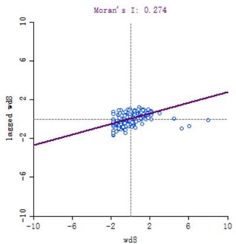  
(a) 全局莫兰指数 (工作日 8 时)

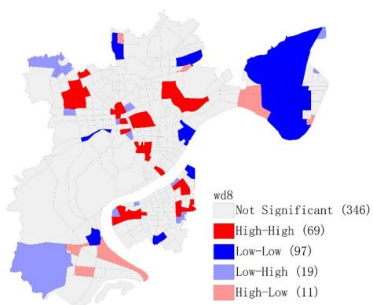  
(b) 局部莫兰指数 (工作日 8 时)

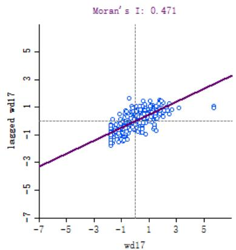  
(c) 全局莫兰指数(工作日 17 时)

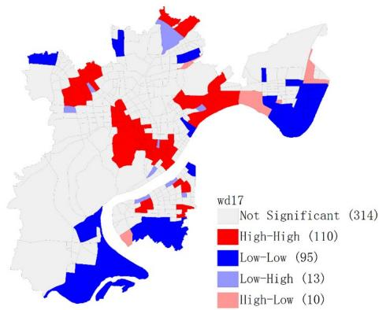  
(d) 局部莫兰指数 (工作日 17 时)

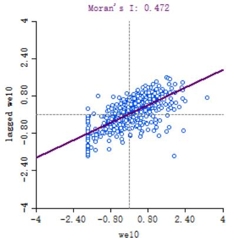  
(e) 全局莫兰指数 (双休日 10 时)

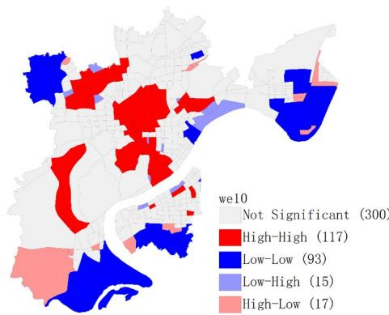  
(f) 局部莫兰指数 (双休日 10 时)

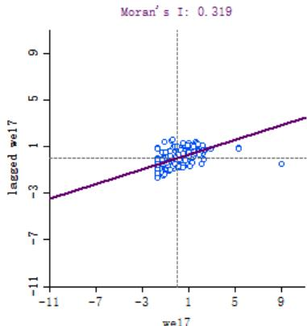  
(g) 全局莫兰指数 (双休日 17 时)

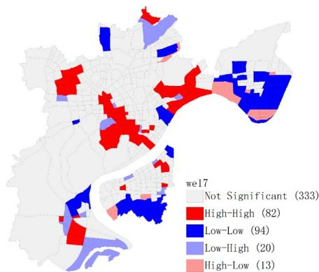  
(h) 局部莫兰指数 (双休日 17 时)  
图4.2 全局与局部莫兰指数

GWR 的基本假设之一是变量之间的关系在空间上是非平稳的，即回归系数

随地理位置的变化而变化。空间自相关性是 GWR 模型能够发挥作用的一个重要

前提。如果数据不存在空间自相关性，那么 GWR 模型的效果可能不如预期，甚

至可能导致模型过度拟合。通过全局与局部莫兰指数的分析，可以判断数据适合

使用 GWR 模型，自变量与因变量间存在着空间自相关性，这种空间非平稳性可

能存在。因此，下面我们将优化之前的PCA-RF模型，引入地理加权，探究地理

加权随机森林模型 GWRF。

# 4.1.4 地理加权随机森林模型

GWRF 是传统随机森林 (RF) 的扩展，它结合了地理加权回归 (GWR) 的思

想，允许模型参数 (决策树的构建过程) 随地理位置的变化而变化。GWRF 不是建

立一个全局统一的随机森林，而是在每个局部区域构建一个不同的随机森林模

型。这样做的好处是能够捕捉空间非平稳性，即变量之间的关系随空间位置的变

化而变化。

对于每个预测位置，GWRF 首先确定其周围的邻近观测点；邻近观测点根据

其与预测位置的距离进行加权，距离越近的观测点权重越大，反之则越小；权重

计算方式采用距离衰减函数；基于加权后的局部观测数据，构建一个随机森林模

型，使用局部随机森林模型对该预测位置进行预测；将上述过程移动到空间中的

每一个预测位置，最终得到一个空间变化的预测结果。

对于 PCA-GWRF 模型进行评估，并与 PCA-RF 模型进行对比，可见 PCA-GWRF 模型在所有时间段均优于 PCA-RF 模型：工作日 8 点，调整后 R² 从 0.860提升至 0.910，RMSE 从 0.073 降至 0.059。周末 10 点：MAE 从 0.038 降至 0.029，显示模型对局部异质性的更好适应。GWRF通过地理加权机制捕捉空间非平稳性，而PCA-RF可能忽略了局部空间效应。但同时需验证GWRF的带宽参数选择是否合理，避免过拟合。

表 4.2 PCA-RF 模型和 PCA-GWRF 模型的性能比较  

<table><tr><td>Time</td><td>Model</td><td>R²</td><td>Adjust R²</td><td>RMSE</td><td>MSE</td><td>MAE</td></tr><tr><td>工作日</td><td>PCA-RF</td><td>0.865</td><td>0.860</td><td>0.073</td><td>0.005</td><td>0.050</td></tr><tr><td>8时</td><td>PCA-GWRF</td><td>0.913</td><td>0.910</td><td>0.059</td><td>0.003</td><td>0.036</td></tr><tr><td>工作日</td><td>PCA-RF</td><td>0.875</td><td>0.870</td><td>0.077</td><td>0.006</td><td>0.050</td></tr><tr><td>17时</td><td>PCA-GWRF</td><td>0.912</td><td>0.909</td><td>0.064</td><td>0.004</td><td>0.040</td></tr><tr><td>双休日</td><td>PCA-RF</td><td>0.887</td><td>0.882</td><td>0.049</td><td>0.002</td><td>0.038</td></tr><tr><td>10时</td><td>PCA-GWRF</td><td>0.928</td><td>0.925</td><td>0.039</td><td>0.002</td><td>0.029</td></tr><tr><td>双休日</td><td>PCA-RF</td><td>0.871</td><td>0.866</td><td>0.075</td><td>0.006</td><td>0.053</td></tr><tr><td>17时</td><td>PCA-GWRF</td><td>0.921</td><td>0.918</td><td>0.059</td><td>0.003</td><td>0.040</td></tr></table>

# 4.2 可解释机器学习评价模型 SHAP 分析

SHAP算法是Lundberg, Scott M 等人提出的一种基于附加特征属性的解释机器学习模型的方法。它基于博弈论中的 Shapley 值概念，用于确定每个特征对于

模型输出的贡献程度。SHAP 算法通过对特征子集进行组合并计算不同特征子集对预测结果的平均边际贡献，来为每个特征分配一个 Shapley 值。

SHAP通过计算特征加入模型时的边际贡献来评估每个输入参数的重要性，

其符号表示正向或负向影响，绝对值表示对整体的影响程度。

$$
y _ {i} = y _ {\text {b a s e}} + f \left(x _ {i 1}\right) + f \left(x _ {i 2}\right) + \dots + f \left(x _ {i j}\right) \tag {4.1}
$$

式中 $y _ { b a s e }$ 为目标变量在所有样本中的平均值； $f \left( x _ { i j } \right)$ 为 $x _ { i j }$ 的 SHAP 值，通过特征的 SHAP 值大小，最终分析出造成拥堵因素的重要性程度

# 4.2.1 PCA-RF 模型 SHAP 分析

对 PCA-RF 模型主成分 SHAP 分析，并转换成解释变量，如图 4.3，4.4

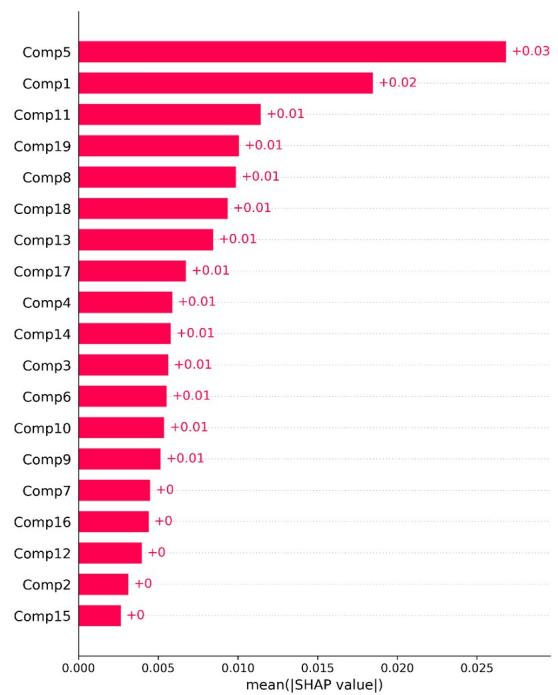  
(a) 工作日 8 时

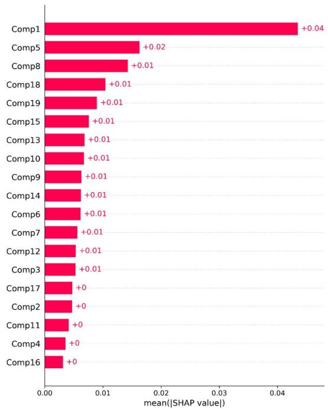  
(b) 工作日 17 时

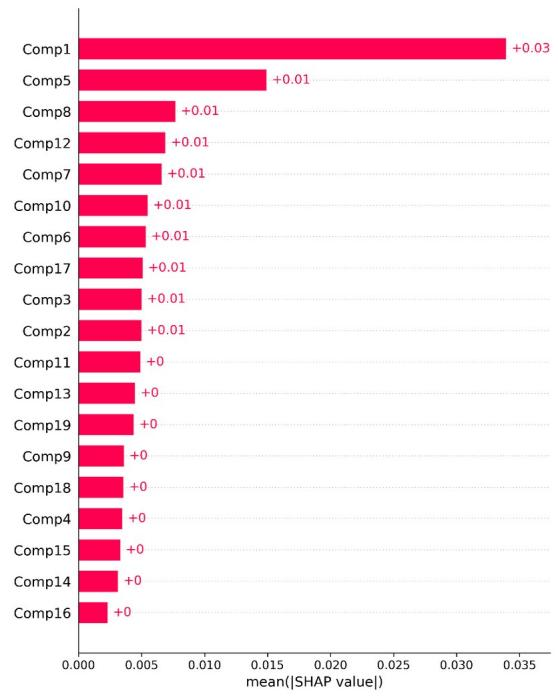  
(c) 双休日 10 时

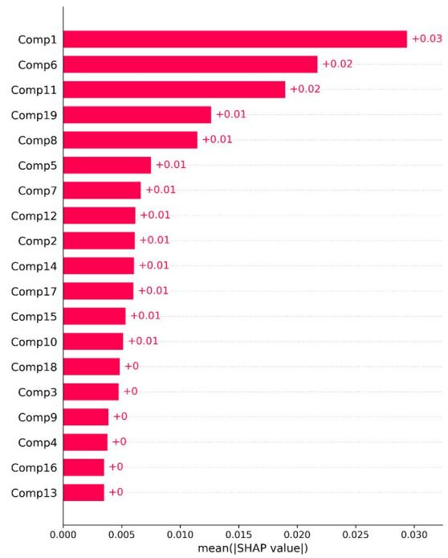  
(d) 双休日 17 时

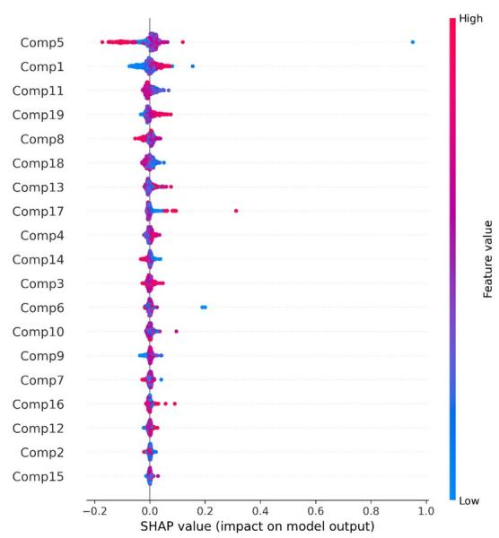  
图 4.3 主成分 SHAP 平均值  
(a) 工作日 8 时

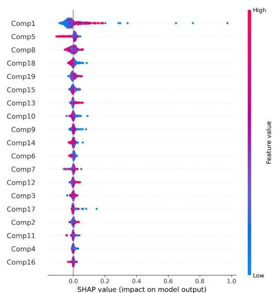  
(b) 工作日 17 时

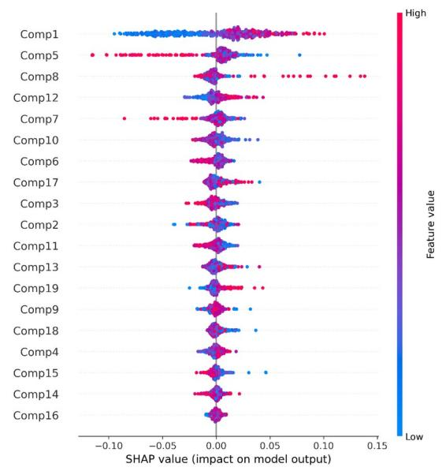  
(c) 双休日 10 时

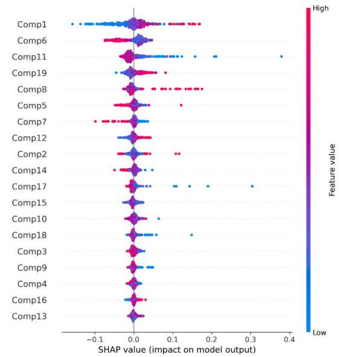  
(d) 双休日 17 时   
图 4.4 主成分 SHAP 收益

如 图 4.5 （ a ） （ c ） 早 高 峰 中 ， DESGN_RDC （ 道 路 中 心 度 变量）、DESGN_RDC（车道设计变量）对拥堵影响显著。

如图 4.5（b）（d）的工作日与双休日晚高峰中，DENS_SM（商场密度）成

为主导因素，这可能与经济商业活动有关，人们在工作日下班回家去超市买菜，或者在双休日晚上购物，因此商场密度成为对拥堵贡献度大的因素。

这体现了早晚高峰模式差异：早高峰更依赖基础设施密度，晚高峰则与和人

口流动与商业经济活动相关。

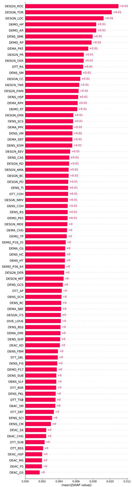  
(a) 工作日 8 时

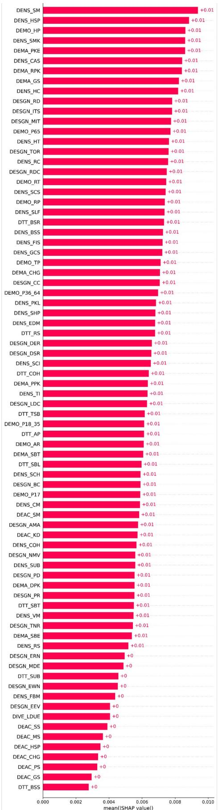  
(b) 工作日 17 时

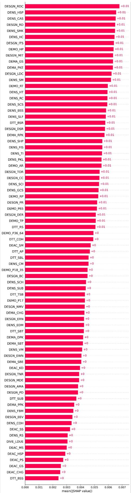  
(c) 双休日 10 时

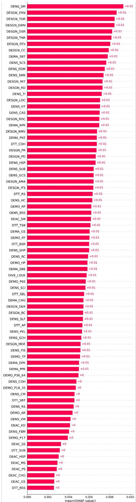  
(d) 双休日 17 时

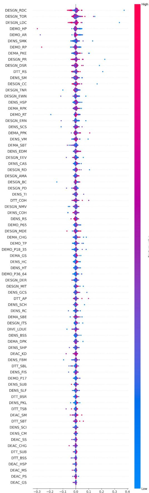  
图 4.5 解释变量 SHAP 平均值  
SHAP value (impact onmodel output)

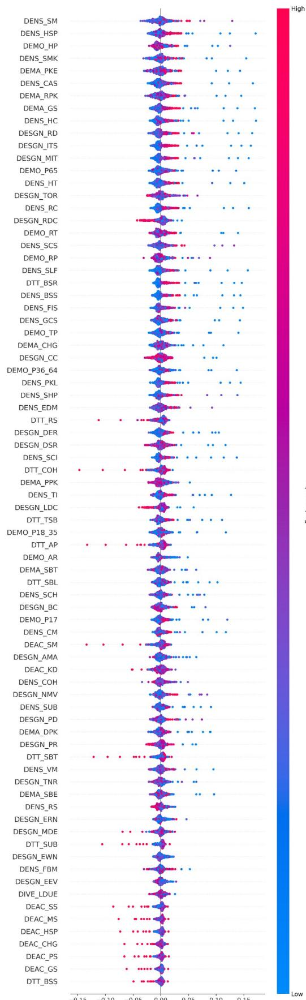  
SHAPvalue (impactonmodeloutput)

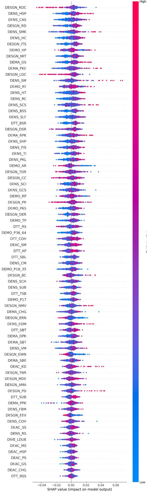  
(a) 工作日 8 时  
(c) 双休日 10 时

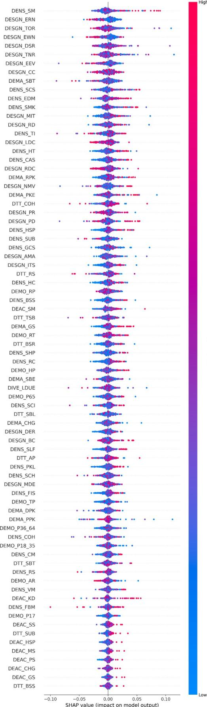  
(b) 工作日 17 时  
(d) 双休日 17 时

最终得到在工作日 8时、工作日 17时、双休日 10时、双休日 17时，各类POI密度指标、设计指标、土地利用混合度指标、目标可访问性指标、运输距离指标、需求管理指标、交通需求设施的密度、人口统计学指标等几大类建成环境的指标对于拥堵的影响。由SHAP值可知，在各个时间段，各类POI密度指标与设计指标对于交通拥堵贡献值都最为显著。

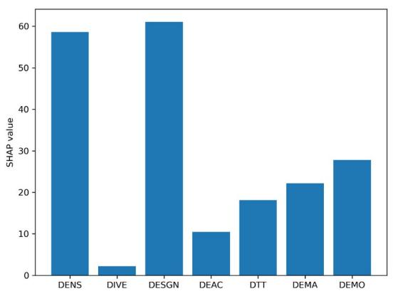  
图 4.6 解释变量 SHAP 收益

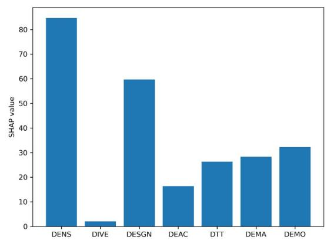

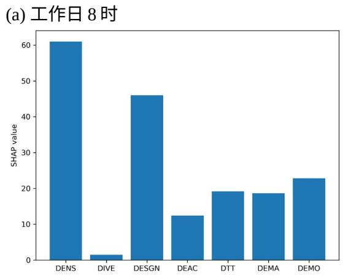

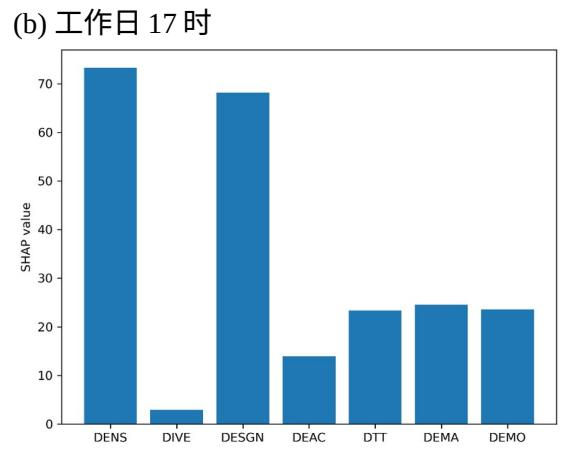  
(c) 双休日 10 时  
(d) 双休日 17 时   
图4.7各类指标对于拥堵贡献度影响

# 4.2.2 PCA-GWRF 模型 SHAP 分析

由图4.8到4.11可得，随着交通小区的不同，各种解释变量对于拥堵的贡献值不同，体现了空间异质性。

在时间维度上，对比工作日8时（图4.8）和17时（图4.9），8时的交通拥堵在部分区域可能更多由通勤出行为主的因素影响，如靠近居住区且连接就业区的道路周边，相关设计变量（如 DESGN_DC、DESGN_RD等）贡献度较高，表明道路设计、连接性等对早高峰交通流有重要作用。17时的拥堵除了道路因素，反映人们经济活动的需求调控属性变量（如 DEMA_PPK、DEMA_RPK 等）贡献度在一些居住集中区域上升，反映下班返程时人口分布和流动对拥堵的影响增强。

在工作日与双休日对比上，双休日10时（图4.10）和17时（图4.11），整体上拥堵贡献度分布与工作日差异明显。10时部分商业、休闲娱乐功能区的相关密度变量（如DENS_SMK、DENS_CAS等）贡献度增加，体现周末休闲出行对交通的影响。17时虽然也有出行高峰，但与工作日晚高峰相比，交通拥堵的驱动因素中，人口属性相关变量影响相对减弱，而城市设计相关变量的作用分布范围

和程度有所不同，说明周末出行目的和模式改变了拥堵的影响因素构成。

在空间维度上，核心区域与外围区域存在差异。在核心区域，各类变量对交通拥堵的贡献度更为复杂和集中。例如设计变量（DESGN_TOR、DESGN_WDC等）在多个时段都有较高贡献度，反映核心区城市设计对交通组织的关键作用。而外围区域，人口活动经济密度变量（如DENS_SM、DENS_HSP等）在某些时段贡献度较高，表明人口的聚集和疏散对周边交通的影响。

不同功能区的拥堵贡献度变量特征不同。商业区在各时段，商业设施密度变量（如DENS_SMK）对拥堵贡献度较突出；居住区在工作日早晚高峰和双休日晚上，人口属性变量（如 DEMA_HP）贡献度明显；工业区周边，道路设计和交通流量相关变量（如 DESGN_RD、DTT_RS 等）在工作日对拥堵影响较大。

为缓解交通拥堵，在空间策略上，针对靠近中心点的热点区域，可优化路网设计；在外围冷点区域可加强公共交通覆盖。

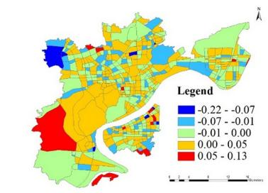  
(a) DESGN_DC

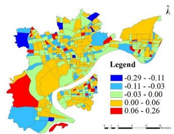  
(b) DESGN_TOR

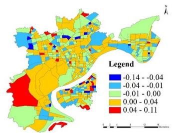  
(c) DESGN_WDC

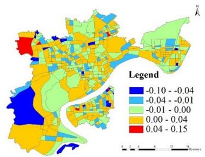

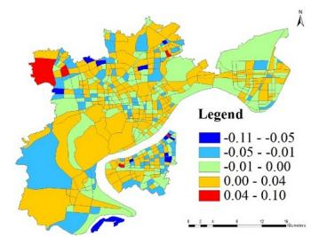

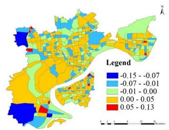

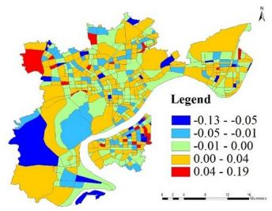  
(d) DEMO_HP

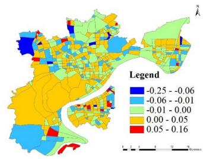  
(e) DEMO_AR

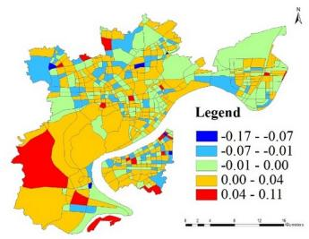  
(f) DENS_SMK

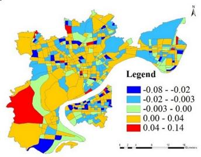  
(g) DEMO_RP

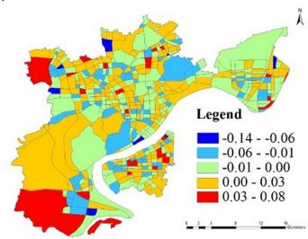  
(h) DEMA_RPK

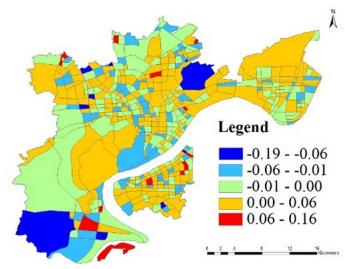  
(i) DESGN_PR

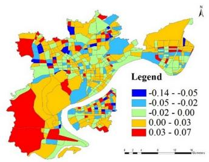  
(j) DESGN_DSR

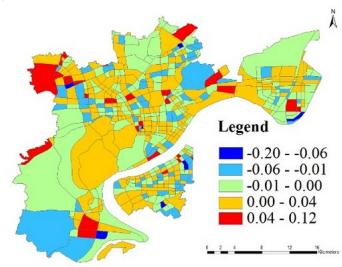  
(k) DTT_RS

(l) DENS_SM

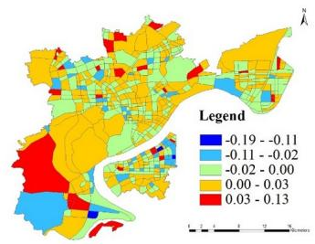  
(o) DESGN_EWN

(m) DESGN_CC

(n) DESGN_TNR

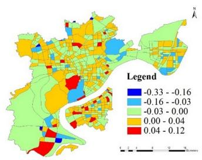  
图4.8 工作日8时各类解释变量对于交通拥堵指数贡献度的空间分布

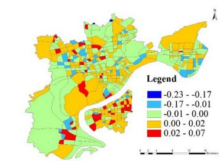

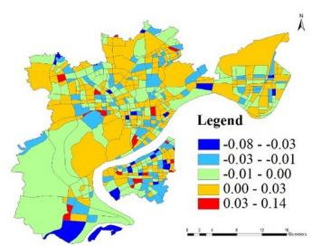  
(a) DENS_SM   
(b) DENS_HSP   
(c) DEMO_HP

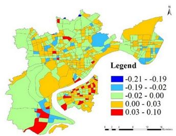

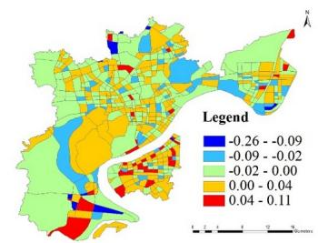

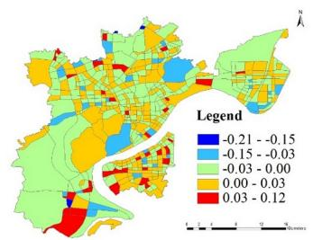

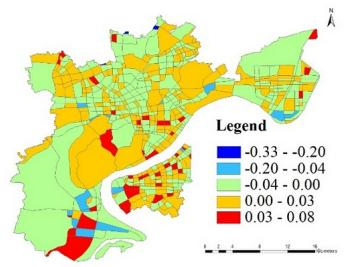  
(d) DENS_SMK

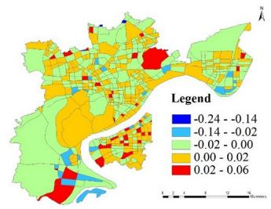  
(e) DEMA_RPK

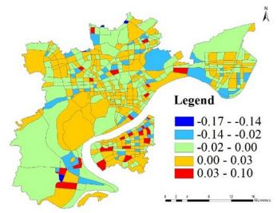  
(f) DENS_CAS

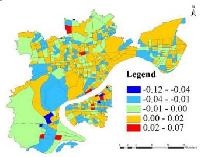  
(g) DEMA_PKE

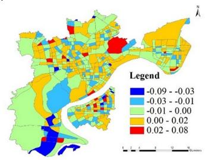  
(h) DEMA_PPK

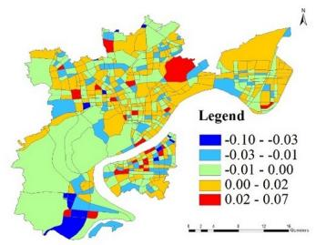  
(i) DENS_HC

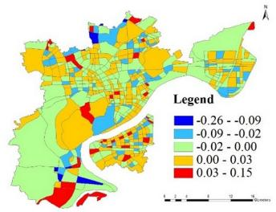  
(j) DESGN_RD

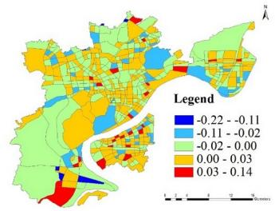  
(k) DESGN_ITS

(l) DESGN_MITS

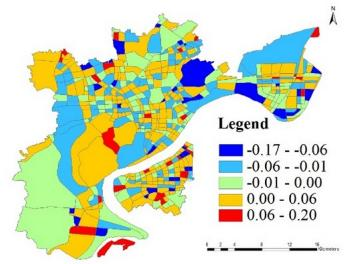  
(o) DESGN_TOR

(m) DEMO_P65

(n) DENS_HT

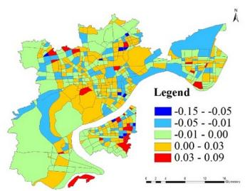  
图4.9 工作日17时各类解释变量对于交通拥堵指数贡献度的空间分布

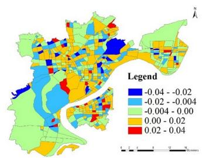

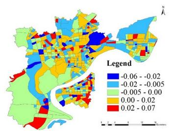

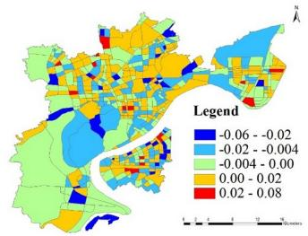  
(a) DESGN_DC

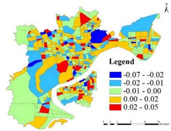  
(b) DENS_HSP

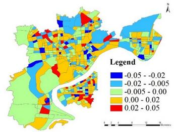  
(c) DENS_CAS

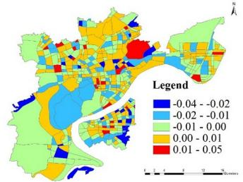  
(d) DESGN_RD

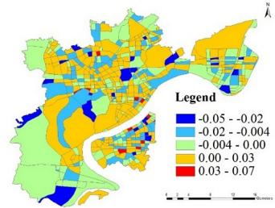  
(e) DENS_SMK

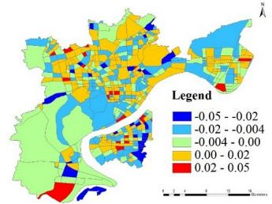  
(f) DENS_HC

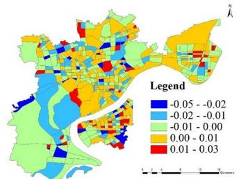  
(g) DESGN_ITS

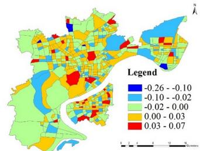  
(h) DEMO_HP

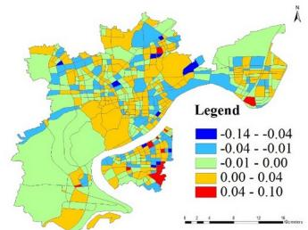  
(i) DESGN_MITS

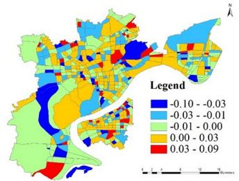  
(j) DEMA_PPK

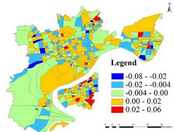  
(k) DEMA_RPK

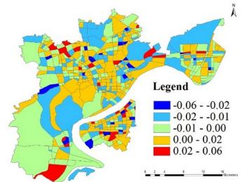  
(l) DESGN_WDC   
(m) DENS_SM   
(n) DEMO_RT  
(o) DENS_HT   
图4.10 双休日10时各类解释变量对于交通拥堵指数贡献度的空间分布

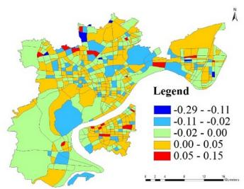

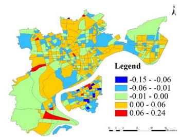

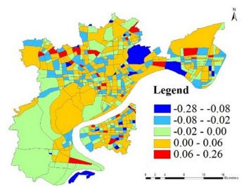

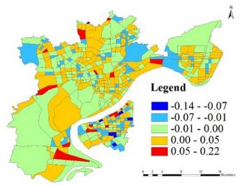  
(a) DENS_SM

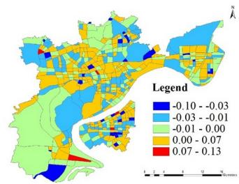  
(b) DESGN_ERN

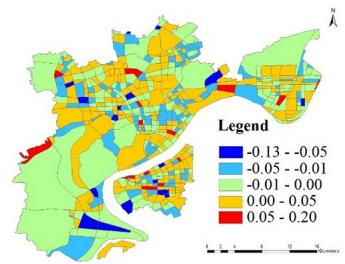  
(c) DESGN_TOR

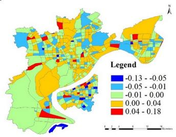  
(d) DESGN_EWN

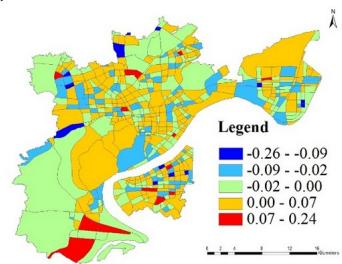  
(e) DESGN_DSR

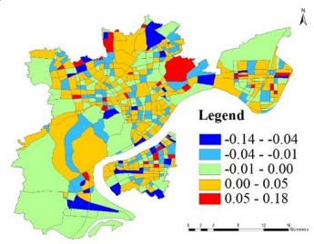  
(f) DESGN_TNR

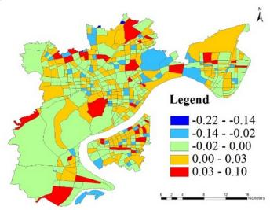  
(g) DESGN_EEV

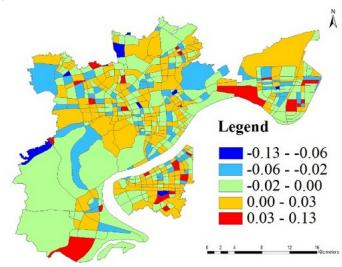  
(h) DESGN_CC

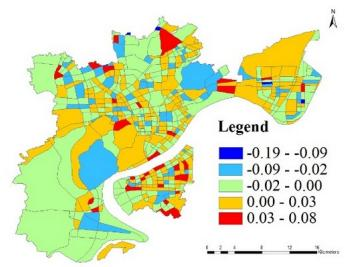  
(i) DEMA_SBT

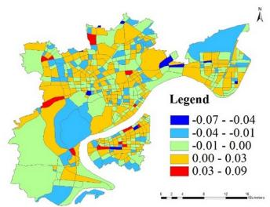  
(j) DENS_SCS

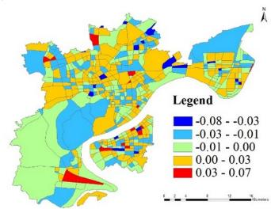  
(k) DENS_EDM

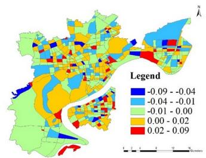  
(l) DENS_SMK   
(m) DESGN_MITS   
(n) DESGN_RD   
(o) DENS_TI   
图4.11 双休日17时各类解释变量对于交通拥堵指数贡献度的空间分布

# 第5章 基于亲和传播聚类的模式分析

# 5.1 亲和力聚类算法

项目接下来预计采用亲和力传播聚类算法（简称 AP 聚类），该方法的聚类数目在迭代的过程中自动生成，AP 聚类的过程可视为 “亲和力”消息在两数据点之间双向传播,通过消息在数据点之间传播,可从被聚类的节点中选出聚类中心,同时将数据点划分到最可能的聚类集合内。上述两种消息的主要区别是消息在节点 i 和节点 k 之间相向传播,即传播方向相反。用 r(i,k)表示节点 k 作为节点 i 的聚类中心的适合程度,a(i,k)则表示将节点 i 视为节点 k 的聚类中心的适合程度。每次迭代均会更新 r(i,k)和 a(i,k),根据 r(i,k)和 a(i,k)选择聚类中心点,当满足某一预设条件时,例如达到最大迭代次数,达到获取稳定点的迭代次数等,AP 聚类算法结束运算。

项目将首先从主成分的角度进行聚类，随后将主成分转换成解释变量，最后再将聚类结果空间可视化，预计得到建成环境对城市交通拥堵的的各类模式，展现不同区域建成环境影响的空间异质性，反映交通需求的集中与分散。并将结合

# 第6章 项目进展与展望

本项目基于杭州市 2017 年 12 月 4 日——2017 年 12 月 10 日的出租车 GPS

数据以及道路网数据，已经完成了数据预处理，通过拥堵评价指标 INRIX 计算与

可视化，分析了交通拥堵的时空模式，并对建成环境解释指标进行了选择与体系

构建。模型对比评估了 PCA-RF 模型与 PCA-GWRF 模型，并得到了 PCA-GWRF

模型能够捕捉空间非平稳性，精度更高的结论，并以可解释机器学习评价模型

SHAP方法。对与建成环境解释变量对于拥堵的贡献度进行了分析，得到了有关

交通拥堵与优化措施的部分结论，完成了论文综述部分的撰写。

下一步，项目将对各类解释变量对于交通拥堵指数贡献度的空间分布进行分

析归纳，探究其空间异质性，并对于PCA-GWRF模型所得到的结果进行聚类模

式分析，更全面探究建成环境因素对于交通拥堵影响的结论，完成论文的撰写，

为杭州市治理提供切实可行的建议。

本项目所建立的PCA-GWRF在空间异质性处理上表现优异，未来进一步融合

实时数据（如天气、事件）提升动态预测能力，并且通过时空交叉验证确保模型

鲁棒性，避免过拟合。

# 参考文献

[1] 杨马英, 楼挺, 李一飞. 城市道路未来车速预测模型研究[J]. 小型微型计算机系统, 2018，39(12):2748-2752.  
[2] Wang J, Chi L B, Hu X W, et al. Urban traffic congestion pricing model with the consideration of carbon emissions cost[J]. Sustainability, 2014, 6(2):676-691.   
[3] Tirachini A, Hensher D A, Rose J M. Multimodal pricing and optimal design of urban public transport: The interplay between traffic congestion and bus crowding[J].Transportation Research Part B: Methodological, 2014, 61:33-54.

[4] Ahmed F, Hawas Y E. An integrated real-time traffic signal system for transit signal priority, incident detection and congestion management[J]. Transportation Research Part C: Emerging Technologies, 2015, 60:52-76.   
[5] Luo Y, Hadiuzzaman M, Fang J, et al. Assessing the mobility benefits of proactive optimal variable speed limit control during recurrent and nonrecurrent congestion[J]. Canadian Journal of Civil Engineering, 2015, 42(7):477-489.   
[6] Gordon R. Non-Recurrent Congestion: Improvement of Time to Clear Incidents[M]. Cham: Springer International Publishing, 2016, 41-90.   
[7] Chen Z, Liu X C, Zhang G. Non-recurrent congestion analysis using datadriven spatiotemporal approach for information construction[J]. Transportation Research Part C: Emerging Technologies, 2016, 71:19-31.   
[8] 孟凡林. 基于浮动车大数据的城市交通拥堵自动辨识与可视化系统[D]. 长安大学计算机应用技术, 2016.  
[9] D'Este G M, Zito R, Taylor M A P. Using GPS to Measure Traffic System Performance[J]. Computer-Aided Civil and Infrastructure Engineering,

2002,14(4):255-265.

[10]Bozhao Li ， Zhongliang Ca i ， Mengjun Kang ， Shiliang Su ， Lili

Jiang，Yong Ge& Yanfen Niu（2022）：一种改进的基于隐马尔可夫模型的地

图匹配算法，考虑候选点分组和轨迹连通性，制图学与地理信息