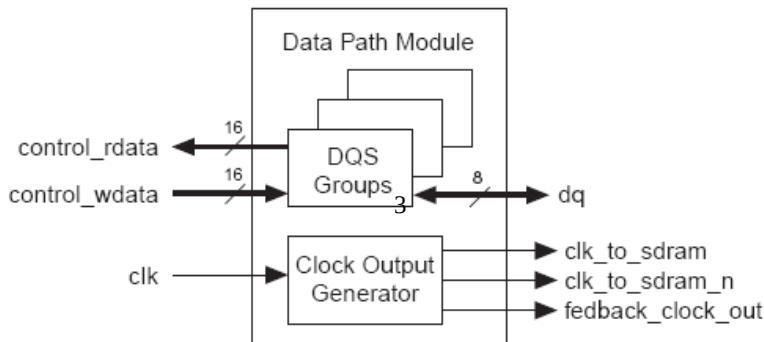
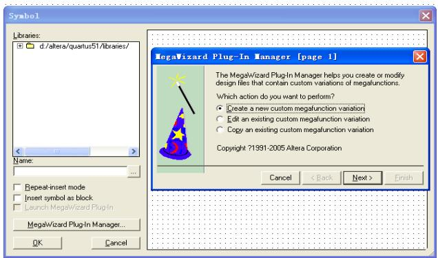

# 武汉大学大学生创新训练

# 计划项目结题报告

（1号宋体居中）

# Altera DDR IPCore 在海量图像无级缩放

# 硬件实现系统中的应用

（2 号黑体居中）

院（系）名 称：XXXXXX

专 业 名 称 ：XXXXXX

# 二○一三年三月

附件二：英文扉页示例

# INTERIM REPORT OF PLANNING

# PROJECT OF INNOVATION AND

# ENTREPRENEURSHIP TRAINING OF

# UNDERGRADUATE OF WUHAN

# UNIVERSITY

（Times New Roman 2 号居中）

# Writing the Title of the Report

# in English here

（Times New Roman 2 号居中）

College ：XXX XXX

Subject ：XXX XXX

Name ：XXX XXX XXX XXX

Director ：XXX Professor

（Times New Roman 4 号居中）

# March 2013

（Times New Roman 小 2 号居中）

中期报告：Interim Report

结题报告：Final Report

附件三：声明示例

# 郑 重 声 明

本项目组呈交的中期报告，是在导师的指导下，独立进行研究工作所取得的成果，所有数据、图片资料真实可靠。尽我们所知，除文中已经

注明引用的内容外，本报告的研究成果不包含他人享有著作权的内容。

对本报告所涉及的研究工作做出贡献的其他个人和集体，均已在文中

以明确的方式标明。本报告的知识产权归属于培养单位。

项目组签名： 日期：

附件四：（1）中文摘要、关键词示例

# 摘□□要

（黑体小 2）

目前对于CCD相机捕获的卫星图像的浏览和动态缩放这个比较棘手的问题的解决方案大多是通过对原始图像进行分割，然后分块显示。这些方法实现起来相对比较容易，开发成本也比较低，但是局限性非常之大，使浏览极为不便，移植性也较差。在本项目中为了解决海量图像方面的这个技术瓶颈，提出了大容量缓存加无级缩放算法的方案。 (宋体小 4 )

关键词：关键词1；关键词2；关键词3；关键词4；关键词5

（黑体小 4）

（宋体小 4）

附件四：（2）英文摘要、关键词示例

# ABSTRACT

# (Times New Roman 小 2 加粗)

This report is carried out on the basis of the 211 project-Ssmi-physical simulation system for ship motion control. …… (Times New Roman 小 4 号)

Key words: motion control；autopilot；neural；GIS

（Times New Roman 体小 4 加粗） （Times New Roman 体小 4）

附件五:目录示例

# 目□□录（黑体小 2）

摘要…

ABSTRACT…

第1章□绪论…

1

□□1.1□研究背景

1.2□研究意义 3  
1.3□研究方法  
1.4□研究内容 8

（各章的名称黑体4号，其余宋体小4，最右端页码为Times New Roman 5号）

# 第3章□关于海量图像无级缩放

□□3.1□无级缩放算法原理 21   
3.2□无级缩放算法的PC模拟 25   
□□□□3.2.1□ 25   
□□□□3.2.2□ 28

# 第6章□结论与展望

45   
参考文献…… 48  
致谢… 51   
附录… 52

(结论、参考文献、致谢及附录黑体4号)

# 第 1 章□绪论（黑体小 2）

# 1.1□概述（黑体 4 号）

□□IP（Intellectual Property）就是常说的知识产权，[1]IPCore（知识产权核）则是指用于产品应用的专用集成电路（ASIC）或者可编程逻辑器件（PGA）的逻辑块或数据块。[2]

（宋体小 4）

# 3.1□无级缩放算法原理（黑体4号）

□□通过 DDR IPCore 对 DDR 和 DDR2 SDRAM 进行初始化是有分别的，由于在本次项目设计过程中实际采用的是 DDR SDRAM，因此本文仅仅对前者的初始化时序进行讨论。

（宋体小4号）

附件七：公式、图文示例（用阿拉伯数字分章依序连续编号）

（1）公式示例

$$
\begin{array}{l} f (x, y) = \left\lfloor f (1, 0) - f (0, 0) \right\rfloor x + \left\lfloor f (0, 1) - f (0, 0) \right\rfloor y \\ + \left[ f (1, 1) + f (0, 0) - f (0, 1) - f (1, 0) \right] x y + f (0, 0) \tag {1.1} \\ \end{array}
$$

$$
f = (1 - \Delta Y) \times [ a 0 0 \times (1 - \Delta X) + a 0 1 \times \Delta X ] + \Delta Y \times \left\lfloor a 1 0 \times (1 - \Delta X) + a 1 1 \times \Delta X \right\rfloor
$$

（1.2）

（2）表示例

普通表示例：

表 1.1□Altera 可提供的基本宏功能单元

<table><tr><td>类型</td><td>描述</td></tr><tr><td>算术组件</td><td>包括累加器、加法器、乘法器和LPM算术函数</td></tr><tr><td>门</td><td>包括多路复用器和LPM门函数</td></tr><tr><td>I/O组件</td><td>包括时钟数据恢复(CDR)、锁相环(PLL)、双数据速率(DDR)、千兆位收发器块(GXB)、LVDS收发器和发送器、PLL重新配置和远程更新宏功能模块</td></tr><tr><td>存储器</td><td>包括FIFO Partitioner、RAM和ROM宏功能模块</td></tr><tr><td>存储组件</td><td>存储器、移位寄存器宏模块和LPM存储器函数</td></tr></table>

统计表示例：

表 3.1□某地 1980 年不同年龄男性调查者 HBsAg 阳性率  

<table><tr><td>年龄组（岁）</td><td>调查数</td><td>阳性数</td><td>阳性率</td></tr><tr><td>0-</td><td>726</td><td>31</td><td>4.27%</td></tr><tr><td>10-</td><td>1392</td><td>115</td><td>8.26%</td></tr><tr><td>20-</td><td>735</td><td>59</td><td>8.03%</td></tr><tr><td>30-</td><td>574</td><td>57</td><td>9.93%</td></tr><tr><td>40-</td><td>463</td><td>27</td><td>5.83%</td></tr><tr><td>50-</td><td>232</td><td>10</td><td>4.31%</td></tr><tr><td>60-</td><td>112</td><td>4</td><td>3.57%</td></tr><tr><td>合计</td><td>4234</td><td>303</td><td>7.16%</td></tr></table>

附件7：公式、图文示例（用阿拉伯数字分章依序连续编号）

（3）图示例

  
图1.2□数据通道模块内部结构  
图 2.2□进入 Symbol 操作界面

附件八：参考文献示例

# 参考文献 (黑体小 2)

[1] 戴军，袁惠新.膜技 术 在 含油废水处理 中 的 应 用[J].膜科学 与 技 术 ，2002，22（2）：59-64.  
[2] 毛侠，孙云.和谐图案的自动生成研究[A].第一届中国情感计算及智能交互学术会议论文集[C].北京：中国科学院自动化研究所，2003：277-279.  
[3] 王湛.膜分离技术基础[M].北京:化学工业出版社，2000：14-21，30.

[4] 张志祥. 间断动力系统的随机扰动及其在守恒律方程中的应用[D].北京:北京大学数学学院,1998.  
[5] World Health Organization. Factors regulating the immune response: report of WHO Scientific Group[R]. Geneva: WHO, 1970.   
[6] 河北绿洲生态环境科技有限公司.一种荒漠化地区生态植被综合培育种植方法[P]:中国,01129210.5[P/OL]. 2001-10-24.  
[7] GB/T16159-1996.汉语拼音证词法基本规则[S].北京：中国标准出版社 ，1996.  
[8] 毛侠.情感工学破解“舒服之谜”[N].光明日报，2004-04-17（B1）.  
[9] 陈剑.上博简《民之父母》“而得既塞於四海矣”句解释[EB/OL］.简帛研究网站，http://www.bamboosilk.org/Wssf/2003/chenjian03.htm，2003-01-18.

( 宋体小 4)

参考文献格式严格按照《武汉大学本科生毕业论文（设计）工作管理办法（修订）》标注